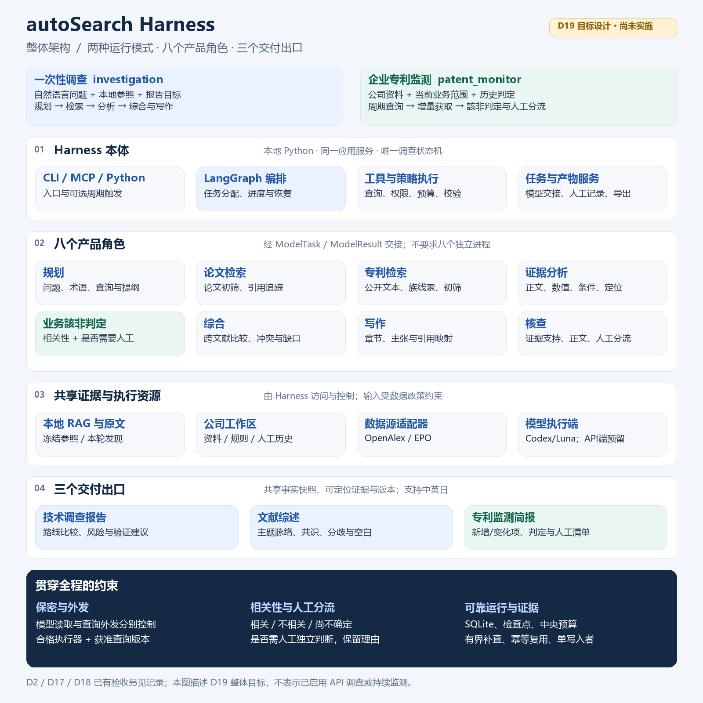

<p align="center">
  
</p>

<h1 align="center">CirootHarness</h1>

<p align="center">
  <strong>特許・科学文献調査のための監査可能な AI research harness。</strong><br>
  調査質問を、バージョン管理された要件・追跡可能な証拠・レビュー可能なレポートへ変換します。
</p>

<p align="center">
  <a href="README.zh-CN.md">中文</a> · <a href="README.md">English</a> · 日本語
</p>

<p align="center">
  <a href="https://github.com/Siyuan-chat/autoSearch-Harness/actions/workflows/ci.yml"></a>
  
  
  
</p>

<p align="center">
  <a href="https://github.com/Siyuan-chat/autoSearch-Harness/releases">Windows 版をダウンロード</a> ·
  <a href="#オフライン-demo">オフライン Demo</a> ·
  <a href="#architecture">Architecture</a> ·
  <a href="docs/DEVELOPMENT_STATUS.md">開発状況</a>
</p>

CirootHarness は、文献・特許調査を対象とする local-first の research harness です。最終回答を生成するだけではなく、調査仕様、source attempt、document version、evidence locator、review decision、実行結果を後から確認できる形で残すことを重視しています。

> **原則:** `partial` は `completed` ではありません。引用は原文へ戻れる状態になって初めて証拠として扱います。また、target design を実装済み機能として表示しません。

## CirootHarness が重視すること

| 課題 | CirootHarness の方針 |
| --- | --- |
| 調査条件の変化 | バージョン化された `ResearchSpec` と frozen inputs |
| 根拠不明の結論 | document version / locator に結び付いた Evidence ID |
| Citation hallucination | quote ownership と原文照合 |
| Retrieval failure の隠蔽 | `complete` / `partial` / `failed` / `unsupported` を明示 |
| 判断が曖昧なケース | human review issue と decision history を保存 |
| 非公開資料 | local-first の document storage / RAG |
| 再現性 | frozen inputs、構造化 state、永続化 artifact |

## 現在利用できる範囲

CirootHarness は現在 public preview です。完成済みの production research service ではありません。

- Windows portable desktop preview（native WebView2 操作の全工程は未検証）
- workspace / library 作成
- テキスト抽出可能な PDF と UTF-8 TXT の import
- desktop preview 内の local basic text search
- LangGraph + SQLite + citation check を使う offline synthetic demo
- 中国語・英語・日本語 report
- acceptance record のある local RAG
- OpenAlex を利用する OA literature collection
- accepted offline scope における evidence / report / review / monitoring primitives
- 新規 PDF ingestion、RAG、report export / reopen を含む bounded paper case
- live patent workflow は引き続き開発中

詳細は [開発状況](docs/DEVELOPMENT_STATUS.md) を参照してください。

## Quick start

### Windows desktop preview

[GitHub Releases](https://github.com/Siyuan-chat/autoSearch-Harness/releases) から portable ZIP をダウンロードし、`ResearchHarnessGUI` フォルダ全体を展開して次を実行します。

```text
ResearchHarnessGUI.exe
```

ウィンドウのブランド名は **CirootHarness** です。実行ファイル名は互換性のため現時点では旧名称を維持しています。

private corpus、model cache、API key は同梱されません。現在の GUI の範囲は [GUI quick start](docs/GUI_QUICKSTART.zh-CN.md) を参照してください。

### オフライン Demo

Python 3.11+ が必要です。

```powershell
python -m venv .venv
.venv\Scripts\python -m pip install .
.venv\Scripts\rh demo --workspace .local\demo
.venv\Scripts\rh status --workspace .local\demo
```

Demo 自体は offline で API key は不要です。synthetic candidate、verified finding、human-review issue、HTML/Markdown report、canonical JSON、review CSV を生成します。

## Architecture



この図は integrated target design を示します。実装・受入済み範囲は別途管理し、計画と実装を混同しません。

[System design](docs/SYSTEM_DESIGN.md) · [Architecture](docs/ARCHITECTURE.md) · [Engineering status](docs/DEVELOPMENT_STATUS.md)

## Demo / showcase

公開 Demo は次の 4 点を短時間で示すことを目的とします。

1. research question → frozen research specification
2. source attempts と実際の coverage
3. claim → evidence → source locator
4. verified conclusion と unresolved review item の分離

撮影手順、asset naming、60–90 秒 storyboard は [Demo showcase guide](docs/DEMO_SHOWCASE.md) にまとめています。

## 現在の制約

public preview は、live model + source API の完全な end-to-end 調査、完全な patent-family coverage、scan PDF OCR、desktop preview の cross-library semantic search、無人 production monitoring、法的意見や FTO 判断を意味しません。

credential、private original、runtime workspace、model cache は Git に含めないでください。

## License / Citation

[Apache License 2.0](LICENSE) で公開しています。技術・研究用途で参照する場合は [`CITATION.cff`](CITATION.cff) を利用してください。
