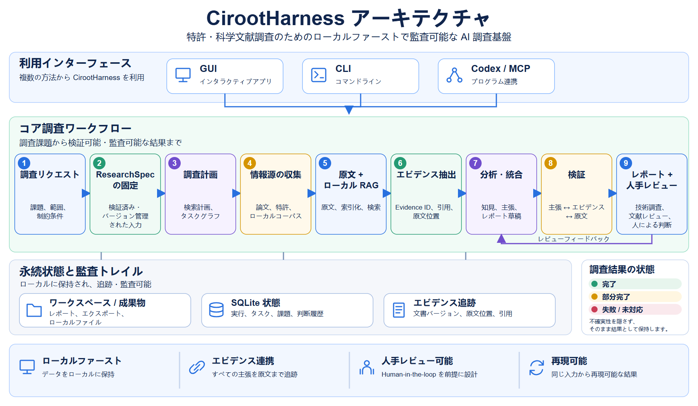

<p align="center">
  
</p>

<h1 align="center">CirootHarness</h1>

<p align="center">
  <strong>特許・科学文献のための、オープンソースで local-first な監査可能 AI research harness。</strong><br>
  回答だけでなく、研究質問をバージョン化された要件・追跡可能な証拠・レビュー可能な研究記録へ変換します。
</p>

<p align="center">
  <a href="README.zh-CN.md">中文</a> · <a href="README.md">English</a> · 日本語
</p>

<p align="center">
  <a href="https://github.com/Siyuan-chat/Ciroot-Harness/actions/workflows/ci.yml"></a>
  
  
  
</p>

<p align="center">
  <a href="https://github.com/Siyuan-chat/Ciroot-Harness/releases">Windows 版をダウンロード</a> ·
  <a href="#オフライン-demo">オフライン Demo</a> ·
  <a href="#architecture">Architecture</a> ·
  <a href="docs/DEVELOPMENT_STATUS.md">開発状況</a>
</p>

## CirootHarness とは？

CirootHarness は、**特許調査、科学文献レビュー、local RAG、証拠追跡可能な AI 支援調査**のためのオープンソース research harness です。research specification、source attempt、document version、evidence locator、review decision、実行結果を保存し、モデルの処理後にも調査過程と結論を検査・再確認できることを重視しています。

> **原則:** `partial` は `completed` ではありません。引用は原文へ戻れる状態になって初めて証拠として扱い、target design を実装済み機能として表示しません。

> **現在の整合状況:** S0–S6 はオフライン候補として進行中です。研究エンジン、各地域の特許情報源と配備については [整合ガイド](docs/INTEGRATION_GUIDE.ja.md)、[受入状況](docs/INTEGRATION_STAGE.md) と [有効化条件](docs/INTEGRATION_ACTIVATION.md) を参照してください。コンポーネント試験の合格は、実 API や科学的効果の受入を意味しません。

## CirootHarness は誰向けですか？

CirootHarness は、回答生成だけでなく**再現可能でレビュー可能な AI research workflow**を必要とする研究者、R&D チーム、特許・研究ツール開発者、AI4Science 実践者を想定しています。現在の public preview はローカル文献ワークフロー、決定論的 Demo、受入済み local-RAG 経路、監査可能な研究基盤に最も適しており、live 特許調査はまだ整合中で production-ready とみなすべきではありません。

## 一般的な research agent と CirootHarness の違い

| 課題 | CirootHarness の方針 |
| --- | --- |
| 調査条件の変化 | バージョン化された `ResearchSpec` と frozen inputs |
| 根拠不明の結論 | document version / locator に結び付いた Evidence ID |
| Citation hallucination | quote ownership と原文照合 |
| Retrieval failure の隠蔽 | `complete` / `partial` / `failed` / `unsupported` を明示 |
| 判断が曖昧なケース | human review issue と decision history を保存 |
| 非公開資料 | local-first の document storage / RAG |
| 再現性 | frozen inputs、構造化 state、永続化 artifact |

## 現在利用できる範囲

CirootHarness は現在 public preview です。完成済みの production research service ではありません。

| 機能 | 現在の状態 |
| --- | --- |
| Windows デスクトッププレビュー | ローカル文献庫向けのポータブル先行版。ネイティブ WebView2 操作は全工程未検証 |
| ローカル作業領域・文献庫 | 作成、テキスト抽出可能な PDF と UTF-8 TXT の取り込み |
| 基本テキスト検索 | デスクトッププレビューで利用可能 |
| オフライン調査デモ | 実際の InvestigationService を利用する決定論的な合成 [Golden Demo](docs/GOLDEN_DEMO.md)。オフライン、API key 不要、期待結果は `partial` |
| 多言語レポート | テスト用シナリオで中国語・英語・日本語の出力に対応 |
| ローカル RAG | Docling/FastEmbed/Qdrant の処理経路に受入記録あり |
| OA 文献収集 | OpenAlex 検索と OA PDF 収集モジュール |
| 調査サービス | 受入済みオフライン範囲の証拠・レポート・レビュー・監視の基本機能を実装 |
| 限定的な論文事例 | P3 で新規 PDF 取り込み、RAG、レポート出力、再オープンを受入済み |
| ライブ特許調査 | 開発中。目標設計を端から端までの受入済み機能として扱わない |

詳細は [開発状況](docs/DEVELOPMENT_STATUS.md) を参照してください。

## Quick start

### Windows desktop preview

[GitHub Releases](https://github.com/Siyuan-chat/Ciroot-Harness/releases) から portable ZIP をダウンロードし、`ResearchHarnessGUI` フォルダ全体を展開して次を実行します。

```text
ResearchHarnessGUI.exe
```

ウィンドウのブランド名は **CirootHarness** です。実行ファイル名は互換性のため現時点では旧名称を維持しています。

private corpus、model cache、API key は同梱されません。現在の GUI の範囲は [GUI quick start](docs/GUI_QUICKSTART.zh-CN.md) を参照してください。

パッケージ内ページでの限定的な初回送信チェックは通過しています。ネイティブ WebView2 操作は未検証です。

<a id="オフライン-demo"></a>

### オフライン Demo

**Public Golden Demo**

Python 3.11+ が必要です。依存関係のインストールにはネットワークが必要な場合がありますが、Demo の実行はオフラインです。

**Windows**

```powershell
python -m venv .venv
.venv\Scripts\python -m pip install ".[investigation]"
.venv\Scripts\rh investigate --workspace .local/golden-demo golden-demo
```

**macOS / Linux**

```bash
python -m venv .venv
.venv/bin/python -m pip install ".[investigation]"
.venv/bin/rh investigate --workspace .local/golden-demo golden-demo
```

実際の InvestigationService を使って固定された決定論的な合成シナリオを実行します。API key やネットワーク接続は不要です。

Golden Demo には意図的に不正な合成 XML 文書が含まれるため、期待される結果は `completed` ではなく `partial` です。

ResearchSpec の固定、情報源・検索の試行記録、証拠付きの検証済み主張、未解決の正規化問題を示し、技術調査レポートと文献レビューを出力します。保存結果と再オープンの手順は [Golden Demo ガイド](docs/GOLDEN_DEMO.md) を参照してください。

従来の `rh demo` はフレームワークのテスト用デモとして残ります。[ユーザーガイド](docs/USER_GUIDE.ja.md)を参照してください。

この合成デモは実際の科学的証拠とは明確に区別され、実情報源による調査の受入を意味しません。

## Architecture

下図は CirootHarness を短時間で理解するための公開アーキテクチャ概要です。詳細設計と各段階の受入範囲はリンク先の技術文書を参照してください。



[原寸 PNG](docs/diagrams/cirootharness-architecture.ja.png) · [編集可能な SVG](docs/diagrams/cirootharness-architecture.ja.svg)

この図は全体の目標設計を示します。実装・受入済み範囲は別途管理し、計画と実装を混同しません。

[全体設計](docs/SYSTEM_DESIGN.md) · [アーキテクチャ](docs/ARCHITECTURE.md) · [開発状況](docs/DEVELOPMENT_STATUS.md)

## Demo / showcase

公開 Demo は次の 4 点を短時間で示すことを目的とします。

1. research question → frozen research specification
2. source attempts と実際の coverage
3. claim → evidence → source locator
4. verified conclusion と unresolved review item の分離

撮影手順、asset naming、60–90 秒 storyboard は [Demo showcase guide](docs/DEMO_SHOWCASE.md) にまとめています。

## 現在の制約

public preview は、live model + source API の完全な end-to-end 調査、完全な patent-family coverage、scan PDF OCR、desktop preview の cross-library semantic search、無人 production monitoring、法的意見や FTO 判断を意味しません。

credential、private original、runtime workspace、model cache は Git に含めないでください。

## ドキュメント

- [開発状況](docs/DEVELOPMENT_STATUS.md)
- [Golden Demo](docs/GOLDEN_DEMO.md)
- [全体設計](docs/SYSTEM_DESIGN.md)
- [アーキテクチャ](docs/ARCHITECTURE.md)
- [要件](docs/PRD.md)
- [データ・アダプター契約](docs/CONTRACTS.md)
- [フレームワーク受入](docs/FRAMEWORK_ACCEPTANCE.md)
- [RAG 受入](docs/RAG_ACCEPTANCE.md)
- [調査計画](docs/INVESTIGATION_EXPERIMENT_PLAN.md)
- [ユーザーガイド](docs/USER_GUIDE.ja.md)

## License / Citation

[Apache License 2.0](LICENSE) で公開しています。技術・研究用途で参照する場合は [`CITATION.cff`](CITATION.cff) を利用してください。
