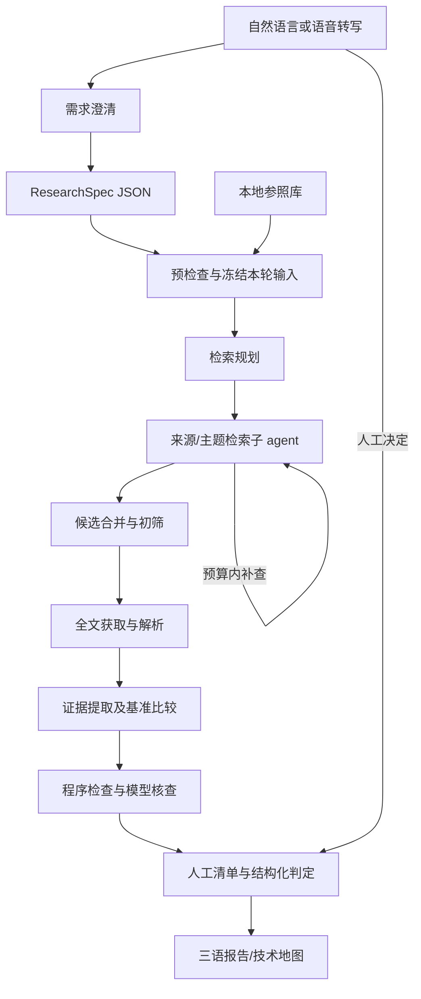

> 当前执行入口：[INTEGRATION_STAGE.md](INTEGRATION_STAGE.md)（2026-10-05，用户批准 S0–S6 实施）。下文历史阶段的“仅设计/不实现 GUI”等表述保留其历史范围，不限制本轮；实际通过状态按本轮固定候选记录。

> 当前整体设计入口：[SYSTEM_DESIGN.md](SYSTEM_DESIGN.md)（D19 v1.0，2026-09-10），含总架构图、两模式工作流、八角色、人工分流与保密边界。GUI 本地封装的当前接口见 [GUI_API_CONTRACT.md](GUI_API_CONTRACT.md)。本文保留 D1/D2 历史架构及阶段补充；新增设计不等于已实现。

> 历史阶段更新（2026-09-10）：D2 已验收结束。D18 本地 RAG 与 Codex/Luna 接入的范围、公共契约和 RG01–RG07 验收以 [RAG_STAGE.md](RAG_STAGE.md) 为准；实际完成记录见 RAG_ACCEPTANCE.md。

> D19 v0.2 设计补充（2026-09-10，尚未实施）：当前目标增加技术调查报告与文献综述双出口。Harness 本体、七个产品角色、来源/证据/写作反馈环及状态边界以 [调查方案第13节](INVESTIGATION_EXPERIMENT_PLAN.md#13-双出口与产品内多-agent-工作流v02) 为准。下文 D1/D2 历史架构不代表所有组件已接入；D18 已完成状态见 RAG_ACCEPTANCE.md。

# 架构设计 D1

> D19 v0.3：增加 patent_monitor 模式与业务該非判定角色，复用调查编排、RAG 和人工历史；定时器只触发单轮服务，检索完成窗口与判定积压分开管理。公司数据的模型读取与查询外发分别控制，缺合格模型执行器时保密任务等待。完整架构与边界见 [调查方案第14节](INVESTIGATION_EXPERIMENT_PLAN.md)，尚未实施。

> D2 当前只落地框架主干：LangGraph 最小流程、现有 SQLite、可替换 fixture 适配器及报告；Docling/向量库/真实来源集成后移。CLI 和未来 GUI 作为薄入口调用同一应用服务，不重复业务逻辑。GUI 不读取 CLI stdout、不直接操作数据库，也不直接依赖 LangGraph 状态对象；本轮不增加 HTTP/WebSocket 或 UI 技术栈。

目标：用成熟组件实现可恢复、证据可追溯的本地调查。职责边界以 [PRD](PRD.md) 和 [数据契约](CONTRACTS.md) 为准；目录结构是建议，实现者可在不改变接口和验收要求的前提下简化。

## 1. 组件与依赖

| 组件 | 拟采用 | 边界 |
|---|---|---|
| 应用入口 | Python CLI + 同一应用层 API | 对话、导入、运行、恢复、审查、导出 |
| 需求澄清 | LLM + Pydantic/JSON Schema | schema-first 生成，参考 grill-me 的单问题澄清 |
| 调查编排 | LangGraph + SQLite checkpointer | 唯一调查状态机；显式节点/子图；本地无需托管账户 |
| 模型调用 | LangChain provider integrations | 首版 OpenAI 兼容与 Anthropic；能力表控制结构化输出/工具行为 |
| 解析 | Docling + 必要 XML 适配 | PDF/OCR/表格，支持的 XML 优先；保留 Docling provenance |
| RAG | LlamaIndex 必要模块 + Qdrant | 切块/检索与向量存储；不使用另一套 agent 编排 |
| 本地向量化 | 可验证的 FastEmbed 多语言模型 | 具体 ID 在实现时从支持清单选定并锁定；检查中英日实际检索 |
| 关键词检索 | 成熟 BM25/全文模块 | 不能直接拿英文分词器宣称中日文支持；保留编号和科学术语 |
| 业务记录 | SQLite | 文档、证据、判定、人工事件、任务账本；向量索引可重建 |
| 数据源 | OpenAlex / EPO OPS | 独立适配；来源特定认证、语法、分页与全文能力 |
| 报告 | 模板渲染 + 规范化 JSON | HTML/Markdown/CSV，模板输出安全转义 |

依赖精确版本由 Terra 在干净环境中解析、集成并锁定，提供支持的 Python 版本和 Windows/Linux 验证结果。不要继承 `.local/pre-handoff/` 中未验证的依赖范围。

Qdrant embedded local mode 适合小型本地验证；首版单进程调度，子 agent 经共享服务访问，统一写入。较大或多进程场景切换 Qdrant server。并行子 agent 不应各自打开同一 embedded 路径。切换模式和更换 Embedding 需要显式索引管理；更换模型不得沿用旧向量集合。

## 2. 产品逻辑图



本轮 LangGraph 状态保存稳定记录 ID、节点游标和配置引用；大文本、原文件、报告、证据落业务库/文件，不无限追加在消息上下文中。

## 3. 需求澄清与执行意图

对话服务维护 session 和当前 spec revision。优先判断 intent：clarify / revise / run / status / review。LLM 可以建议命令，但只能调用白名单应用服务，不能产生任意 shell/SQL/文件操作。

- clarify：读取已有授权的需求与参照概要，问最高价值的一个问题。
- revise：输出完整新 spec 和 change summary，程序验证；不默默扩大费用或云端数据策略。
- run：用户明确执行意图且 ready 时调用运行服务。
- status：只读当前运行和产物。
- review：映射到唯一 review ID 和决定；有歧义才提问。

关键缺口：调查对象完全不明、相互冲突的硬条件、明确阈值但缺单位/测试条件、禁止云端发送却只配置云模型、数据源无法覆盖用户明确的强制范围。可以用“仅描述/相对参照比较”表达没有数值门槛，不把它当成必须盘问用户的缺口。

LLM 输出 Schema 检查失败，给出具体字段错误并进行有次数上限的修复；不能通过删掉用户条件来“修复”。重复失败保存会话、返回可读错误，不启动调查。

## 4. 数据流与身份

- raw documents：内容寻址存储，原字节及下载元数据保持不变。
- document：稳定来源身份；DOI 规范化、专利公开编号及 kind code 规范化；没有稳定标识时用来源记录 ID。仅标题相似不能强行合并。
- document version：内容变化产生新版本；跨来源身份匹配保留 provenance。预印本和出版版本关联而不覆盖。
- evidence：包含 document version、原文、原文位置、解析器/模型版本；稳定 ID 与内容绑定。
- baseline：每轮冻结明确的参照文档版本。用户导入时选择 reference/discovery；新抓取默认 discovery。
- finding：spec semantic fingerprint + baseline fingerprint + document/evidence version + analysis/prompt version 决定复用资格。
- review：稳定 issue key 不随翻译变化；事件日志保留人工历史。
- run：输入、来源覆盖、执行状态、用量与产物；报告数据由这些记录构建。

配置只修改报告语言时可以复用事实判定并重新渲染；指标/排除条件/基准变更触发相关判定失效。Terra 必须记录实际 invalidation policy，禁止盲目复用旧结论。

## 5. 检索子 agent

规划器以关注点、参照术语、同义词、分类号和引用线索构造 source-specific 查询。每个 Query 携带来源、语言、检索表达式、过滤条件和 seed/exploration/gap_followup 意图。

来源子 agent 以“检索任务 → API 返回 → 判断是否补查 → 再检索/结束”的有界子图运行。只有来源适配器可以发 HTTP；agent 无任意网页执行权限。初筛记录理由与原始候选，以供检查漏检，不只保存最终入选者。

每个 source 在本轮拥有独立状态：complete / partial / failed / unsupported。分页未取完、预算用尽、源语言过滤不支持都显示具体限制。空结果只有在成功完成查询后才是有效的 zero-results。

增量使用每来源上次完整查询状态、去重和可配置的时间回看。不能只看 publication_date > last_run：延迟索引和回填需要回看/定期由用户触发完整复查。不同检索式/配置变更需要独立状态，不能共享一个全局日期水位。

## 6. 获取、解析与 RAG

- API 已提供的 XML/结构化文本优先保留。保留原始 XML 标签层级或段落号及来源。
- OpenAlex metadata、abstract 与正文可用性分开；EPO claims/description 可能分别可用，内容覆盖用集合表示。
- PDF 获取使用来源给出的可访问 URL，限制协议、重定向、文件大小、超时；阻止抓取进入本机/私网意外地址。
- 解析失败保留 raw 文件和错误，允许继续其它资料。不得静默退回摘要并标为全文。
- 按章节/段落/表格形成证据，数值与表头、单位、条件和脚注一起保留；大表可分块但保留连接信息。
- RAG 返回原始 evidence ID 与 locator，既检索相关基准，也检索冲突证据。对候选自身进行指标提取不能只依赖一个 top-k 片段。
- 本地 Embedding 记录模型名称/版本、维度、预处理和前缀规则。模型权重下载与数据发送是两回事；不把本地文档发送给权重分发服务。
- 无向量依赖时 doctor 给出明确安装指令。测试可用显式 lexical fixture mode；不能静默降级后声称完成 RAG 验收。

## 7. 科学分析与核查

分析输出 relevance、observations、comparison、disposition、review issues。原始数值作为字符串保存，换算值与换算规则另存。不同条件不可直接排名；用程序检查 criterion ID、单位、必需条件，再由模型解释设计路线差异。

每项关键主张附 evidence/ref evidence IDs。程序验证 ID 属于本轮允许文档版本、quote 与原文对得上、locator 可解。第二次模型核查检查引用是否支持结论，不能把它当独立真值。无依据优势或新颖性结论转 watch/review。

结构化三语表达从同一事实对象生成。翻译不是再次自由分析；数值、标识、单位、方向和 review 状态有不变量校验。报告原文段落仍以原语言保存。

## 8. 恢复、预算与故障

LangGraph checkpointer 保存执行进度；业务写入以唯一键/事务实现幂等。网络调用/模型调用有 operation ID：已经缓存的成功结果可复用；外部请求已提交但响应未持久化的崩溃窗口必须记录“可能重复计费”，不能声称 exactly-once。

中央预算账本累计调用、候选、下载字节、token 和活动运行时间。所有子 agent 在调用前预留配额，完成后结算。并行不能各拿整轮预算；恢复不得清零。SDK 隐式重试应受控并计入限额。

来源 401/403：认证/权限错误，不反复重试；429/临时 5xx：尊重 Retry-After，在次数和总时限内退避。摘要不足、单文档解析失败：记录局部错误继续。缺少全部所需来源凭据：预检查失败，不产生模型调查费用。

run outcome：completed / partial / failed / cancelled。review pending 与 run outcome 正交：有人工清单的完整调查仍可 completed；丢失来源或翻译则 partial。预算耗尽保存已完成结果并生成部分报告。最终报告渲染失败保留规范化 JSON，可单独重试。

## 9. 本地文件与模块建议

```text
src/research_harness/
  cli / application / intake
  contracts / config
  workflow / agents
  providers/models / providers/sources
  ingestion / retrieval
  storage / review / reporting
tests/                      # 小型 fixture、契约及故障测试
docs/                       # 本设计与用户文档
schemas/                    # 可交换格式
examples/                   # 配置草案；未来 demo 单独标注
workspace/                  # Git 忽略：raw、db、index、sessions、runs、reports
```

单实现无需为每个函数建抽象工厂；适配器仅在已知可替换边界定义 Protocol。数据库迁移从最小明确版本开始，不先建设通用插件市场、分布式队列或多租户系统。

## 10. 原始技术依据（2026-09-09 查阅）

- [LangGraph persistence](https://docs.langchain.com/oss/python/langgraph/persistence)：检查点、SQLite、本地恢复。
- [LangGraph subgraphs](https://docs.langchain.com/oss/python/langgraph/use-subgraphs)：独立调用的子 agent 状态隔离。
- [LangChain model integrations](https://docs.langchain.com/oss/python/langchain/models)：能力依 provider 而不同。
- [Docling](https://github.com/docling-project/docling) 与 [provenance](https://docling-project.github.io/docling/reference/docling_document/)：PDF/部分 XML、页码/位置；复杂化学结构理解不能视为已解决。
- [LlamaIndex + Qdrant](https://qdrant.tech/documentation/frameworks/llama-index/) 与 [Qdrant local mode](https://github.com/qdrant/qdrant-client#local-mode)。
- [FastEmbed supported models](https://qdrant.github.io/fastembed/examples/Supported_Models/)：实现时复核准确模型 ID、语言、许可证。
- [OpenAlex full text](https://help.openalex.org/access/fulltext/) 与 [authentication](https://help.openalex.org/api/authentication/)。
- [EPO OPS](https://www.epo.org/en/searching-for-patents/data/web-services/ops) 与 [REST guide](https://link.epo.org/web/searching-for-patents/data/en-ops-v3.2-documentation-version-1.3.20.pdf)。
- [Lens API](https://docs.api.lens.org/)：后续选配，需对应访问权限。

本列表证明技术能力存在，不证明本项目已集成或 API 凭据可用；实际测试见验收记录。

## D17 采集入口（2026-09-10）

`research_harness.literature` 提供有界 OpenAlex search 和开放全文 download 共用函数，`python -m research_harness.literature` 为薄入口。查询配置与筛选后 manifest 是可交换 JSON；新资料作为 discovery 候选原文保存，未自动导入 baseline 或向量索引。未来 MCP/API 适配器复用这些函数，不另建采集状态机。设计、输入字段和真实案例边界见 [OA_COLLECTION](OA_COLLECTION.md)。
