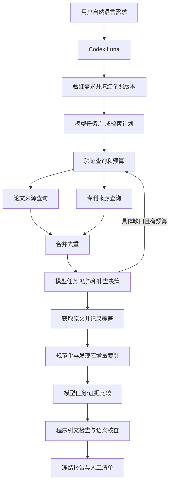
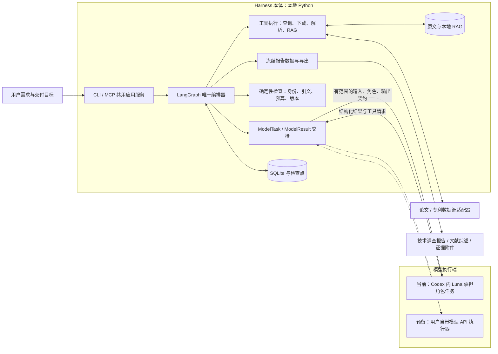
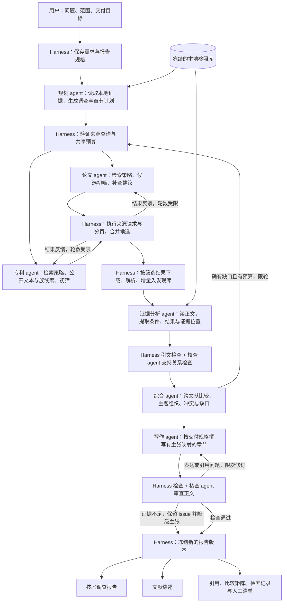
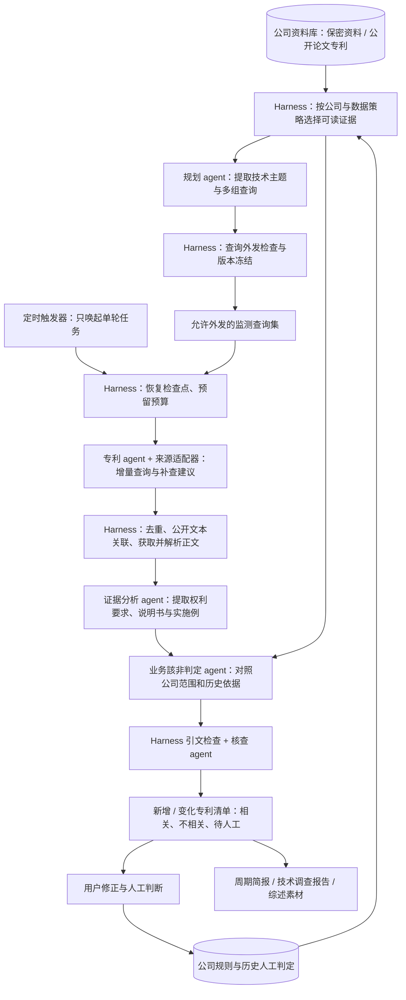

# D19 真实调查链：实施与实验方案

> 整体设计入口：[SYSTEM_DESIGN.md](SYSTEM_DESIGN.md)（D19 整合设计 v1.0，2026-09-10）。本文保留分步实验、拟验收阈值与 v0.1–v0.3 需求补充；目标架构和术语以整合设计为准，详细实验场景仍以本文为准。

2026-09-10 · v0.3 · 设计提案。当前只准备方案，不派发实现、不调用论文/专利业务API、不启动调查或定时任务。下列脚本、接口与验收阈值为拟实施内容，不能当作已经存在或已经通过的能力。第13节增加双报告出口；第14节增加企业资料驱动的持续专利监测和业务/技术相关性判定，并更新早期不含定时监测的范围约束。既有检索、证据和历史验收不变量不变。

**目标：先完成可离线复现的框架、脚本和文档，再接OpenAlex与EPO OPS调试；最终由Codex中的Luna接收自然语言需求，依据本地参照生成检索计划，找到库外论文与专利，获取可用正文，增量入库，输出有来源位置的比较与人工判断清单。**

## 1. 基线、复用与实际缺口

工程起点：780e15b01433f0be23a15dbc72d893cb7d221cc5，已同步到私有仓库Siyuan-chat/autoSearch-Harness。D2、D17、D18的已接受行为和证据继续有效，具体见FRAMEWORK_ACCEPTANCE.md、OA_COLLECTION.md、RAG_ACCEPTANCE.md。

| 当前模块 | 已有能力 | D19需要补齐 |
|---|---|---|
| workflow.py / service.py | LangGraph夹具流程、规范版本、冻结报告、人工判断与结构化服务 | 真实调查节点、宿主模型任务交接、分来源状态、有限补查、阶段恢复 |
| literature.py | OpenAlex搜索、OA位置、下载校验、复用、候选和查询状态；已有真实匿名采集 | 接入调查任务、查询出处和统一预算；可恢复分页；带key的真实验证 |
| providers.py | OpenAlex/EPO查询草稿及部分离线适配检查 | 收敛重复OpenAlex实现；核查EPO认证、分页、身份与正文/专利族获取，不能直接按已上线处理 |
| rag.py | Docling PDF/TXT、E5/BM25检索、版本与上下文、缓存和迁移 | 冻结本轮参照引用、发现库接线；支持专利规范化文本块和XML定位信息 |
| rag_mcp.py | Codex/Luna本地RAG工具已实际通过 | 调查控制、模型任务领取/提交、进度和报告入口 |
| runtime schema | 历史模型API配置形式 | 明确host与api执行模式；host路径不要求生成模型key；保留旧配置兼容 |

现有23篇/584页/8820条证据直接复用，不重新下载、全量解析或嵌入。D18三语成绩是宿主先生成英文检索式的路径；其15/18旧题和新增6/6不能证明外部资料搜索已经通过。

代码审阅发现两个需要先解决的衔接点：旧流程plan节点尚未实现真实规划；旧runtime只列出模型API provider，不能直接作为Codex订阅运行配置。OpenAlex在literature.py与providers.py有重复路径，D19应复用已验证的采集实现并提供兼容包装，避免继续维护两套认证、分页与候选转换。

## 2. 范围与执行身份

本阶段实现：自然语言转ResearchSpec；基于参照证据的SearchPlan；论文与专利检索角色；获取、规范化、增量RAG；有依据的比较；安全错误、预算、阶段恢复；中英日使用与结果；CLI/MCP共用服务。

本阶段不开展GUI、HTTP服务、未经配置启用的定时调查、无限自我扩展、新Embedding模型竞赛、扫描件OCR全覆盖、化学结构图识别、法律有效性/侵权判断或正式发行。企业持续监测已纳入第14节设计，配置完整后才能启用。用户自带生成模型API保留同一任务契约和配置边界；本轮先验收Codex/Luna宿主路径，不顺带实现所有厂商调用器。

- 订阅模式：Luna在Codex内完成规划、初筛、补查与分析；harness只收发结构化任务和结果、执行数据源请求与本地处理。订阅凭据由Codex管理。
- 数据源身份：OpenAlex/EPO凭据与模型身份分开；只引用环境变量名称，doctor输出present/missing等状态，不显示值。
- 开发角色：设计者负责需求、诊断和独立验收；Terra/Luna负责指定实现与简单自测。产品里的检索agent角色与开发协作agent不是同一件事。
- 用户说“调整需求”只保存规范修订；说“执行调查”才创建真实run。当前方案不启动执行。

## 3. 最小可运行架构

只用LangGraph保存调查进度，SQLite保存业务记录；不再加第二套调度状态机。图中涉及模型判断的节点产生结构化ModelTask，由宿主返回ModelResult。断开Codex时记录awaiting_model，重新连接后继续同一个任务。

最小服务边界拟为：

| 操作 | 必须得到的结果 |
|---|---|
| create_investigation(spec, runtime) | run_id、冻结输入和实际preflight状态；不把draft启动成调查 |
| get_pending_tasks(run_id) | 明确任务类型、输入证据、输出schema、任务版本；不是开放式任意命令 |
| submit_model_result(run_id, task_id, result) | schema/所有权/版本检查；同任务相同结果重交幂等，不同结果冲突可诊断 |
| advance_investigation(run_id) | 推进有限的确定性步骤，返回awaiting_model/running/partial/failed/completed等真实状态 |
| status / get_result / get_artifacts | 复用现有公共投影；调用方不直接读SQLite或LangGraph内部对象 |
| resume_investigation(run_id) | 继续已确认的检查点；不清零已消费预算，不覆盖已完成原文和报告 |

研究运行时增加显式model_execution.mode=host或api的边界。host模式只依赖宿主交接，不要求RH_LLM_API_KEY；api模式在调用器未实现时返回明确unsupported，不能假装可以运行。D2原有fixture入口及旧schema行为保持兼容，规范源与包内schema同步。

长下载/解析由同一调查服务的可恢复CLI worker执行，MCP负责提交任务、模型交接和读取状态；不让一次MCP请求等待整批PDF。初版无需常驻后台服务：显式启动worker、保存检查点、完成后退出。Windows需要后台运行时不弹可见终端。

参照库继续只读使用；本轮发现库独立存储。每个Qdrant embedded路径只有一个所有者：获取/索引阶段单写，写入结束释放后进入分析读取。HTTP来源查询可以并行，多个agent不能分别打开同一索引路径。遇到占用显示busy并保留任务，不返回伪造的空结果。

## 4. 数据与查询设计

### 4.1 需求和参照

ResearchSpec记录调查对象、必须/可选范围、指标、比较对象、来源、语言与预算。用户没有提供数值阈值时使用描述或相对比较，不发明合格线；关键单位/测试条件不明时标记未解决，只问影响结果的一个问题。

BaselineSnapshot记录本轮使用的document_id/version_id/evidence引用及指纹。新文献默认discovery；本轮基准不因下载结果自动改变。后续调查可按配置选取已积累发现作为新参照。

### 4.2 SearchPlan

先对本地库做广义与针对性检索，补读关键正文/表格上下文，再组织材料、同义词、结构、机制、应用和性能概念。输出包含原始问题、语料语言、参照版本、术语出处以及逐来源查询。

每条Query至少保存query_id、source、language、expression、filters、purpose、parent_query_id、支持的evidence_ids、validation_result。术语出处区分用户明确提出、原文提取、模型探索；探索词不能伪装成原文事实。

三类目的均须覆盖：根据已知文献扩展、从用户目标探索库外路线、针对具体证据缺口补查。原文参考文献/作者/机构或分类线索可用于扩展，但分类号必须核对后使用；不得把未知正例的DOI/公开号预先塞进查询。

先保存与来源无关的检索意图，再生成OpenAlex和EPO各自支持的表达式。结构化JSON有效不等于数据库语法有效；适配器验证字段及来源能力。不能把同一布尔表达式无修改地发送给所有来源。

需调整D17面向综述的检索默认值：新调查不能固定review_only或只按引用量排序。相关性检索与时间范围/新近资料检索分别记录排序依据；具体可用字段在API调试时依据官方文档确认。

每次修改检索式都保存父查询、修改理由和预期解决的缺口；改写次数有上限。大量命中本身不能证明覆盖充分，低命中也不能自动放松用户硬条件。

### 4.3 候选、专利和证据

| 对象 | 关键规则 |
|---|---|
| SourceAttempt | 请求范围、分页游标、结果数、错误与complete/partial/failed/unsupported分开记录；预算内执行完成不等于全球检索穷尽 |
| Candidate | 候选来源、命中哪些Query、metadata/abstract/full_text覆盖、筛选理由；保留被排除和待判断项目 |
| 论文身份 | 规范化DOI，预印本/正式版关联而不静默覆盖；无DOI保留来源ID |
| 专利身份 | 地区+公开号+kind code；申请号、公开号、授权文本不能混用；专利族聚合展示而不抹掉各文本差别 |
| Acquisition | 原文件/原XML、获取位置、许可信息、内容指纹、成功/失败/只有摘要等状态 |
| Evidence | 保留D18原ID与版本；PDF使用物理页/bbox，XML使用claim/paragraph ID或XPath，不编造PDF页码 |
| Finding | 候选与参照证据、原值/单位/条件、相关性与可比较性、机器建议及核查结果 |

EPO结构化内容保留原XML。新增规范化文本块导入边界，携带text、locator、section_role及来源版本，复用RAG切块/嵌入/存储；不先丢掉权利要求/段落位置再把XML当普通TXT处理。

D19引用逐字匹配原证据子串，并检查所属候选、版本和参照快照；不把多个不连续句子拼成一条“原文引句”。D2既有fixture整段相等检查不变，通过显式投影兼容id/quote与D18 evidence_id/text，不能另造不对应原文的新身份。

权利要求、说明书陈述、实施例结果、论文实验和综述转述分开。未报告不是0，不同条件不判定优劣；无足够正文仍保留候选并输出人工问题。

## 5. 实施顺序与关卡

| 阶段 | 工作及产物 | 进入下一阶段的条件 |
|---|---|---|
| P0 设计冻结 | 本方案、公共任务/结果/来源契约、目录和预算；选定实现与验收材料的隔离方式 | 对接口与通过标准无实质歧义；当前这轮只交付该方案草案 |
| P1 离线框架 | 完整节点和宿主交接、规范化适配器、脚本入口、合成JSON/XML/TXT/PDF、故障注入、三语指南 | 不访问外部数据源即可走完流程；下列F01–F12全部通过；安装包可运行 |
| P2 API单源调试 | 分别验证OpenAlex与EPO认证/查询/分页/正文覆盖，记录真实请求状态和可复现样本 | 两来源各自达到A01–A06；缺凭据的来源标blocked，不阻断另一来源调试 |
| P3 论文闭环 | 真实Luna规划→OpenAlex→初筛→开放全文→发现库→比较 | 至少完成一条库外论文的实际链；引文/过滤/缓存/预算不变量通过 |
| P4 专利与联合闭环 | 真实EPO结果、族关联、可用正文和联合比较；独立冻结集三语验收 | E01–E07通过；失败与覆盖缺口如实记录；代码、安装包、宿主证据对应同一检查点 |

P1完成前不调用真实论文/专利API。P2两个来源可并行，P3与专利故障修复可并行；每个阶段先自测提交，再由设计者独立验收，不等所有工作结束才首次整合。

## 6. 要交付的代码、脚本与文档

以共用Python服务为事实来源；CLI、PowerShell入口和MCP不复制业务流程。下列命令是拟实现的接口，不是当前可执行命令。

| 入口或文件 | 责任与输出 |
|---|---|
| 现有service.py/workflow.py及必要的调查模块 | 新增真实调查路径、ModelTask交接、检查点；保留run_fixture |
| 现有providers.py/literature.py | 两来源适配、规范化和统一分页/预算；已有OpenAlex入口兼容 |
| 现有rag.py与必要XML规范化模块 | 独立发现库、版本映射及规范化块导入 |
| 拟新增investigation_mcp.py | 薄控制工具层；不修改当前aem_rag工具的既有语义 |
| schemas与包内schemas | 调查任务/结果、host配置、source attempt的schema；同一权威来源 |
| examples/investigation/ | 无key的host运行配置、draft需求、明确synthetic的离线场景 |
| `rh investigate doctor` | 本地依赖/模型/路径/配置能力检查，默认无网络 |
| `rh investigate plan validate` | 校验计划、术语出处、来源语法能力和预算；不执行搜索 |
| `rh investigate start / tasks / submit / work / resume` | 创建调查、领取与提交模型任务、推进确定性步骤及恢复 |
| `rh investigate source-smoke --source openalex\|epo --live` | 明确真实小流量调试，输出经过脱敏的source attempt与覆盖清单 |
| 复用status/get_result/report入口 | 实际进度、完整结果、冻结报告与人工清单 |
| scripts/investigation.ps1 | 一个Windows薄入口，负责路径/启动方式；不按每一步再造一个脚本 |
| tests/test_investigation*.py及来源测试 | 合成流程、任务幂等、版本、分支失败、预算等实现者自测 |
| acceptance/probe_investigation_offline.py | 设计者离线独立验收；外部网络禁止 |
| acceptance/probe_sources_live.py | 同一探针对不同source运行单源检查，避免两套重复脚本 |
| acceptance/probe_investigation_e2e.py | 冻结集评分、引文检查、实际宿主trace核验 |
| docs/INVESTIGATION_USAGE.zh-CN/en/ja.md | 安装、host模式、凭据配置、运行/恢复、报告与故障排查 |
| 更新ARCHITECTURE/CONTRACTS/DECISIONS及阶段验收记录 | 说明真实调用链、已支持能力和通过层级；历史结果保留 |

不提前建立没有实际消费者的provider工厂、GUI占位模块或多个状态框架。具体文件拆分可由实现者在职责边界内简化，但公共接口和语义变更须回传设计者。

每轮运行建议保存在.local/investigations/<run-id>/：manifest.json、search-plan.json、source-attempts.jsonl、候选/筛选记录、原始资料、discovery索引、模型任务/结果、报告和review清单。原文、真实API响应、模型会话与私有评价集不提交Git。公开文档只保存必要的命令、版本、统计与匿名化故障说明。

## 7. 离线实验：F01–F12

P1使用合成ModelResult驱动模型交接，不调用云模型或外部数据源；真实Codex/Luna调用在后续宿主验收单独验证。离线输入使用显式synthetic材料，覆盖正常正文、只有摘要、重复DOI、同族不同公开文本、分页、坏PDF、坏XML、错误引用和条件冲突。可重放的真实响应必须另标recorded_response；重放成功不算live API通过。

| ID | 操作 | 必须观察到 |
|---|---|---|
| F01 | draft/缺单位规范启动；ready规范启动 | 前者不发请求并给字段原因，后者绑定不可变spec和baseline |
| F02 | host运行不配置模型key | 产生真实待办模型任务；不会因缺模型key阻断，也不会后台调用生成API |
| F03 | 提交计划/修改计划/重复提交 | schema和证据出处检查；保留版本；同结果幂等，不重复执行查询 |
| F04 | 两来源多页及重复候选 | 正确游标和query lineage；DOI去重；专利同族不同文本保留 |
| F05 | 401/403、429、超时、5xx、坏JSON/XML | 认证失败不反复重试；临时失败有限退避；空结果与失败可区分 |
| F06 | 一来源失败、另一来源成功 | 保留成功来源结果，整体partial；不能把失败来源标complete |
| F07 | 小预算+并行来源+中断恢复 | 调用前预留，累计不超限；重启不清零；未确认请求标uncertain并计入预算 |
| F08 | 下载失败/摘要/坏PDF/有效全文 | 分别保留状态；未获得全文不冒充全文；问题不丢候选 |
| F09 | 新资料入库、重复入库与版本更新 | 新资料属discovery，baseline不变；重复不增ID，旧版本仍可引用 |
| F10 | 伪造ID、他文引句、改写引句、条件冲突 | 不进入确定性结论，转watch/review；原模型输出和规范化结果分开保存 |
| F11 | 关闭并重启宿主，提交旧任务结果 | 正确恢复awaiting_model；过期任务拒绝，已完成步骤不重复 |
| F12 | 非editable安装与CLI/MCP入口 | schema/示例随包可用，协议输出规范；已接受D2/D18相关行为不回归 |

F01–F12属于不变量检查，要求全部通过；不使用平均分抵消数据身份、引文或状态错误。

## 8. 真实API调试：A01–A06

先单源小规模：每来源一个查询、每页最多5条、最多2页；各获取1个已知可用正文样本。此阶段诊断连接、身份和格式，不优化相关性。故意触发认证失败/限流的实验在离线完成，不用错误凭据反复请求真实服务。

| ID | 检查 | 记录 |
|---|---|---|
| A01 | 真实host进程读取正确的环境变量并完成认证 | 来源、凭据存在状态、HTTP状态/安全错误、检查点版本；不记录key/token |
| A02 | 一条来源有效查询返回可核对记录 | 实际query/filter、文献ID/公开号、题名和时间字段 |
| A03 | 有至少两页的已知查询 | continuation、页间关系、去重、截断原因；小预算导致partial属预期 |
| A04 | 正文/章节获取 | OpenAlex候选到OA文件实际来源；EPO可用的abstract/claims/description、XML位置与缺口 |
| A05 | 下载/分页中断后继续 | 已完成文件复用，恢复依据明确，未知网络结果不被假定为未执行 |
| A06 | 安装包调用与源状态投影 | 真实结果是普通JSON；CLI/MCP/报告的来源状态一致 |

先以当前官方文档核对认证和语法，再测试。当前OpenAlex带key和EPO的真实认证尚没有本项目通过证据。若EPO不能覆盖选定地区/正文类型，记录具体unsupported范围并重新界定案例覆盖；不能悄悄用摘要替代全文通过。

## 9. 联合调查实验与独立评价

拟选择两个AEM调查主题：交联/增强对传导与溶胀的影响，以及阳离子/骨架结构与耐碱稳定性。只测试检索、证据与比较链，不给材料性能补造目标值。

设计者在实现者调试集之外，为每主题选取4篇本地库外论文与4个相关专利公开文本，共16个唯一目标，并确认来源可查询、必要章节可读取。不同语言复用同一目标，但分别只提供中文、英文或日文需求给规划模型。题目、目标、支持位置、允许的证据集合和评分程序在首次评测前冻结；目标ID不提供给查询规划器和实现者。

共2主题×3语言=6次任务，每次8个目标，48个“目标-任务”机会。以下为本方案提出、待设计冻结的工程门槛：

| ID | 指标 | 拟通过标准 |
|---|---|---|
| E01 | 全流程实际运行 | 6次均从自然语言开始，无人工补写检索式；真实Luna工具调用可追溯 |
| E02 | 已知目标候选召回 | 总计≥40/48；每语言≥12/16；论文和专利各≥18/24。只说明该冻结集覆盖，不称全网召回率 |
| E03 | 初筛质量 | 每次抽查排序前min(10,N)项，相关率≥80%，N为实际返回候选数且至少为5；不足5项记证据不足，不用空集通过。每个被找到的金标准目标不得被无依据静默丢弃 |
| E04 | 获取和回库 | 每次至少1篇库外论文全文及1个专利的claims或description实际入发现库；只有摘要不能满足该项；所有未成功资料有状态 |
| E05 | 引文与身份 | 最终报告所有正式引文ID/版本/原文/定位检查100%通过；失败引文进入人工清单而非正文确定结论 |
| E06 | 科学语义 | 每任务预先固定3个问题，共18个；至少16个被独立判为有充分支持或正确识别不可比较/未报告。伪造数值、把claim当实验结果、错配单位/脚注等实质错误为0；不能靠全部回答“未知”通过 |
| E07 | 停止、恢复与报告 | 中断一个联合任务后继续；基准与旧报告不变、预算累计、成功分支保留，输出报告/人工清单/来源覆盖 |

语义问题预先标明可回答或确实缺证据；可回答题只回复“未知”记未通过。预先检查金标准在对应资料和指定章节中确实存在，支持可能跨多个相邻块；不能再次把“跨段支持”错误写成“同块必须同现”。如在评分后发现评价程序错误，保留旧版和旧分数，单独版本化修正；针对失败题调整过的方案必须另加未见题复验。

消融只做一次有目的的对照：同一任务、同一预算下，比较“仅用户需求生成查询”和“用户需求+RAG证据生成查询”。保存两套计划，比较目标召回、候选相关性、重复率、API调用数和耗时。该小实验用于判断RAG术语扩展是否有用，不证明普遍统计优势；不进行大范围模型/参数网格搜索。

## 10. 预算、性能与恢复

| 资源 | 单源调试 | 正式小规模调查的建议上限 |
|---|---|---|
| 初始查询 | 每来源1条 | 每来源3条 |
| 扩展 | 0轮 | 最多2轮，每来源每轮最多1条新查询 |
| 候选 | 每来源最多10条 | 每run全来源合计50个去重候选，重复响应也记录流量 |
| 获取全文 | 每来源1份 | 初筛后每run最多10份；论文/专利均保留覆盖 |
| 并发 | 来源各自单请求 | 全局最多3个I/O任务；每来源限速另行遵守；每索引单写 |
| 下载体积 | 复用现有单文件限额 | 单文件30 MiB、每run累计300 MiB |
| 模型任务 | 用最少步骤排障 | 每run最多120个harness发出的模型任务；JSON修复最多2次 |
| 活动运行时间 | 逐请求限时 | 初值30分钟；P2依据分阶段实测在首次正式评分前校准并统一冻结。到期保存partial/pending，不自动延长或重置已耗时间 |

这些是可修改工程上限，不是材料合格线、服务商费用承诺或完成时长保证。不同查询的分页共用中央预算；网络超时后服务端是否完成未知，记录uncertain，不默认重复请求免费。

host模式只能准确统计harness发出的模型任务、工具调用与可观察耗时。宿主内部推理次数、完整订阅token或实际账单若不可观察则为null，不宣称精确计费或精确限制全部模型调用。

必须分别记录规划、来源查询、下载、解析、嵌入、分析的耗时。首个真实调试样本就测解析/嵌入，只有发现新性能问题才扩大基准。不重跑23篇建库，不为仅查询计划/排序/报告变化重算原向量。优先结构化XML与已有文本，按正文内容指纹复用缓存。

错误按层诊断：宿主没有发工具→接线；工具没出HTTP→调度/配置；HTTP拒绝→认证/限流；有响应无候选→语法/解析；候选无正文→覆盖/下载；有正文无支持→切块/检索/分析。连续两次修改仍出现同一症状时回到分层探针，不继续盲目换模型或重建全库。

## 11. 分工与提交检查点

| 负责人 | 文件/任务所有权 | 提交条件 |
|---|---|---|
| 设计者 | 本方案、规范变更、私有金标准、acceptance探针、根因诊断与最终判定 | 依据不可变实现提交独立测试；不写产品实现 |
| Terra | service/workflow、source适配、RAG接线、存储/预算/恢复、依赖/包内schema、最终产品集成 | 明确阶段自测与可复制命令；产品代码和简单自测形成提交 |
| Luna | investigation MCP、宿主任务交接与通用模型任务说明、CLI/控制接入指南及相关协议测试 | 与核心契约对齐，fake协议与真实宿主结果分开；不写题目答案进提示词 |

具体公共文件只由Terra集成；Luna提出schema/依赖需求，不与Terra同时编辑这些文件。沿用隔离工作树，按阶段提交；设计者直接回传问题并复验，常规修正不要求用户人工转交。

检查点建议：C0接口/评价冻结；C1无网络框架+脚本文档；C2两来源单源调试；C3论文闭环；C4专利联合与独立评价；C5最终安装包/原生Codex配置/归档。按实际结果推进，不承诺以文件数量或固定工时替代通过标准。

## 12. 最终交付与当前待定项

最终交付：可安装包及版本、CLI/MCP脚本、两来源配置模板、三语指南、真实小规模案例、独立验收报告、来源覆盖/失败清单、可恢复运行状态及原始证据引用。达到上述范围后停止，不自动扩展数据源、GUI或科学功能。

不影响先搭框架的待定项：具体专利地区/年代优先级、正式案例的关注指标、API凭据可用性。进入真实调试前通过本地环境变量配置OPENALEX_API_KEY、EPO_CONSUMER_KEY、EPO_CONSUMER_SECRET；不要在对话中发送密钥。没有硬性地区要求时，先测试EPO实际可覆盖的公开样本并报告范围；不能默认覆盖全球所有全文。

官方接口依据：[OpenAlex API参考](https://help.openalex.org/api/)；[EPO OPS与公开文档](https://www.epo.org/en/searching-for-patents/data/web-services/ops)。本轮只核对文档；API服务能力、认证与数据覆盖以P2实际记录为准。

## 13. 双出口与产品内多 agent 工作流（v0.2）

### 13.1 从交付目标反推调查

用户最终可能需要技术调查报告、文献综述，或两者。输出目标在需求阶段写入报告规格，影响研究问题、检索覆盖、提取字段和章节计划；不能直到最后才把同一份候选清单换标题导出。

技术调查报告回答“有哪些技术路线、证据支持什么差异、哪些路线值得进一步验证”；文献综述回答“领域如何发展、机制与方法如何组织、证据在哪些地方一致或矛盾、有哪些未解决问题”。文献综述默认是有检索记录的主题综述草稿；系统综述或元分析须另定协议与方法验收，不能自动贴此标签。两种结果都可以是正式可读的交付物，但系统核查状态与用户最终审定状态分开。

### 13.2 Harness 本体与模型执行边界

实线表达目标主路径，虚线表达预留 API 执行器；图不代表 D19 已实现。工具请求经服务校验、中央预算和状态检查后才执行，模型不能直接改变数据库、预算或冻结证据。MCP/CLI 传递结构化结果，不另建第二个调度器。

这里的 agent 是带角色、输入范围、工具权限和输出契约的逻辑任务。首版可由一个 Codex/Luna 会话顺序承担，隔离每次任务的输入并持久化结果；论文与专利的网络请求可并行。多角色不等于多个操作系统进程，也不等于必须为每一篇资料创建一个 agent。将来宿主支持多个工作者时复用同一任务交接，不改变科学证据契约。审查角色与写作角色分开输入和任务，但同一模型互审不称为独立科学验证。

### 13.3 各角色在工作流中的位置

图中“结果反馈”通过待办任务恢复来源角色，不要求模型阻塞等待网络。初筛后才下载；证据综合后的补查走相同预算与候选管线。正文核查发现科学证据缺口时记录 GapRequest，由编排器送回综合/规划阶段决定补查，不能由写作角色自行新增事实或直接访问任意来源。循环受第10节的全局预算约束。

| 产品角色 | 输入与动作 | 结构化输出与边界 |
|---|---|---|
| 规划 agent | 需求、报告目标、本地参照证据；拆解问题、组织术语、制定来源策略及初步章节 | SearchPlan、研究问题与章节提纲；探索词标注出处，不编造分类号 |
| 论文 agent | 已验证的论文检索任务与返回候选；判断相关性、研究类型、追踪可核实的引用线索 | 候选筛选理由、正文请求、查询修订建议；实际请求由适配器执行 |
| 专利 agent | 专利任务、公开文本元数据、可用族信息；识别相关技术与需要读的文本 | 公开号/kind、族关联依据、正文请求及补查建议；不输出侵权或法律有效性结论 |
| 证据分析 agent | 逐文献相关全文、表格上下文和参照；提取材料、方法、数值、单位、条件、原文位置 | Evidence 引用、observations、单项 Finding；区分论文实验、综述转述、权利要求与实施例 |
| 综合 agent | 通过检查的证据、单项 Finding、来源覆盖、用户问题 | 跨文献比较、主题及机制脉络、矛盾解释、GapRequest；保留不一致证据与不可比较项 |
| 写作 agent | 章节计划、已核查事实与综合主张、报告目标、目标语言 | 章节正文与 claim-to-evidence 映射；技术调查/综述使用不同组织方式，引用由引用表解析 |
| 核查 agent | 待核查的主张或正文、对应原文上下文与反证；不依赖作者自评 | supported / contradicted / insufficient 及理由、修订任务；由程序另验 ID、版本、原句和数值不变量 |

Harness 编排器负责阶段选择、任务分配、模型返回验证、工具权限、预算、缓存、并发、重试、恢复和停止，不再增设一个可随意改变流程的“总指挥模型”。下载、解析、嵌入、引用编号和导出是确定性服务，不包装成额外 agent。

### 13.4 两种交付出口

| 维度 | 技术调查报告 | 文献综述 |
|---|---|---|
| 主要用途 | 面向技术路线选择和后续验证 | 面向领域理解、研究定位与学术写作 |
| 正文章节 | 调查问题与结论摘要；范围与方法；路线地图；条件一致的性能/方法比较；相关专利布局；风险与建议验证；未解决问题 | 范围与检索方法；概念和主题框架；机制/方法/发展脉络；证据一致性与分歧；研究空白；结论与展望 |
| 论文与专利 | 联合对照，专利公开文本与实验依据分别呈现 | 论文为主体；与主题相关的专利单列技术转化内容，保持证据类型标签 |
| 建议/展望 | 建议对应发现与限制；未实施实验明确是拟验证方案 | 研究空白对应覆盖和冲突证据，推测与已知发现区分 |
| 共享附件 | 引用目录、证据定位、比较矩阵、来源覆盖、查询/筛选记录、人工清单 | 同左；不能把引用很多的综述误当作多项独立实验支持 |

两者均支持中英日，先形成共享事实层，再完成选定语言正文和核对。初版输出 Markdown/HTML 正文、JSON 结构化数据、CSV 比较/人工清单及由真实元数据生成的 BibTeX 引用目录；缺少书目信息保持缺失并标明。DOCX/PDF 排版可后续接渲染器，当前不扩展桌面排版工具链。原文引用与翻译标明区别；正文读者不需要看到任务哈希、内部调用账本和调试日志，这些放工程附件。

### 13.5 最小契约增量与版本规则

优先扩展现有 ResearchSpec、Finding 和 ReportData，不建立平行证据库或独立写作状态机。以下为设计字段，待实现时落实到权威 schema：

- ResearchSpec 内嵌 report_spec：deliverables（technical_report / literature_review，可多选）、audience、languages、depth、research_questions、section_outline、review_type。普通技术报告无需强迫填写综述类型；未指定篇幅时按证据量形成紧凑完整初稿。
- ModelTask 增加 role、task_type、input_refs、allowed_operations、output_schema_ref；复用已有任务 ID、输入版本与预算绑定。接收同一执行契约的宿主或后续模型 API，可使用同一种模型或不同模型。
- Finding 承载综合主张所需的 support_refs、counterevidence_refs、conditions、verification；跨文献主张保留每一来源类型及关联，避免把综述和被其引用的同一实验双计为独立支持。
- ReportData 增加报告规格、选定事实快照、sections（section_id、正文、claim_ids）、claims（原子主张、finding/evidence_refs、核查状态）、bibliography、coverage、review_snapshot。原始模型草稿另存，正式正文只使用检查后的版本。
- GapRequest 包含缺失问题、影响章节/主张、所需证据、建议检索范围。编排器接受、拒绝或延期并记录原因；无预算时生成有缺口的报告，不为补完文章擅自提高配额。
- get_artifacts 的 D19 产物描述增加 deliverable_type、report_version；保留原有 language/format/path。共同附件明确关联的报告版本；D2 旧客户端仍可读原字段。

写作前冻结选定证据与 Finding 快照，写作/核查通过后冻结 ReportData。修改报告语言或表达只重写相应章节；改变输出类型若需要新增研究问题或证据，先做缺口评估，再按明确运行意图补查，不能声称换模板就完成综述。补查形成新的事实与报告版本，旧版不可覆盖。导出失败只重试导出，不重新查询或解析。用户审定结果以独立事件记录，不等同于模型核查通过。

### 13.6 对原实验方案的增补

P1 的离线终点必须是两种有实际正文的合成交付物，不只是候选列表；增加同一事实集分双出口、错误正文引用、语义过度概括、翻译数值变化、修订上限、导出失败独立重试的代表性场景。包内需包含双模板、角色任务说明和对应三语用法。模型语义核查质量仍须后续真实宿主验证，离线注入结果只证明控制流程。

P3 论文闭环先产出仅含论文的技术调查报告和主题综述小样；专利待接入的状态在覆盖说明中明确。P4 六次三语调查各生成两种出口，共12份正文，共用各 run 的事实快照，不重复搜索。除 E01–E07 外增加以下拟冻结门槛：

| ID | 独立验收内容 | 通过条件 |
|---|---|---|
| O01 | 12份正文的结构与实质 | 6份技术调查均回答对应技术问题并给出有依据的比较/验证建议；6份综述均有跨文献主题综合及分歧/缺口，不能逐篇摘要拼接；材料不足必须明示 |
| O02 | 双出口和三语事实一致 | 同 run 的数字、条件、证据身份与核查状态无冲突；跨语言等价科学问题的结果可因检索不同而不同，但必须各自有据，不强制捏造相同结论 |
| O03 | 正文主张和来源支持 | 全部正式科学主张有可解析支持映射或明确推测/未解决标记；程序引用检查100%通过。每份独立抽4条关键主张，共48条，至少44/48得到语义支持，且不得出现材料优劣、数值条件或证据类型的重大错误；不足4条则正文不足，不悄悄缩小分母 |
| O04 | 更改、恢复和独立导出 | 重写/翻译不改变冻结证据；导出重试不产生数据源请求；旧报告保留；无预算或修订耗尽时问题有记录、结论降级或移出确定性正文 |

核查后正文修订每个交付物默认最多2轮，全部角色任务仍计入原120个模型任务上限；写作不另获免费预算。首轮规划须给分析、双出口写作和核查预留任务配额。P2 的统一耗时校准纳入综合、写作、核查、渲染四段，再冻结正式评价预算；不承诺沿用旧耗时即足够完成新增双出口。

开发分工延续：Terra 实现编排、证据/报告结构、预算与导出；Luna 实现宿主角色任务说明、交接和用户指南；设计者负责本节契约、独立正文/证据验收和根因诊断。这里的开发者 Terra/Luna 与上表七个产品角色是两个层次。本次仅更新架构与实验设计，不启动开发。

## 14. 企业 RAG 驱动的持续专利监测与該非判定（v0.3）

### 14.1 已确认需求与产品模式

用户已确认“該非判定”指公司业务/技术相关性判定。相关性为相关、不相关、尚不确定；是否需要人工处理独立输出，详见14.6。本功能形成 patent_monitor 模式，与一次性 investigation 共用来源适配、证据、判定、预算、人工清单和报告服务。新增持续监测需求更新历史 PRD 对定时监测的排除，但本次仅设计，不创建本机计划任务或 Codex 自动任务。

输入为指定公司的 RAG 库：保密技术资料、该公司已公开的专利和论文，以及可选的历史人工判定。公司名称/申请人名称不是唯一相关性条件；需要发现其他申请人涉及本公司技术范围的专利。公司过往发表内容也不自动等于当前全部业务范围，须结合当前关注点与显式排除规则。

### 14.2 工作流与角色复用

新增一个业务該非判定角色，复用原证据分析结果。它负责把“专利涉及的技术”与“公司当前业务及技术关注点”建立有依据的对应，输出判定和理由；专利搜索角色负责发现候选，不把搜索命中直接当作相关结论。核查角色验证理由是否由双方证据支持。Harness 仍是唯一流程控制者，定时触发器只提交 tick/run 请求，不另建调查状态机。

### 14.3 保密资料与外发边界

本地 RAG 存储与模型推理地点是两个边界。任何内容一旦进入外部宿主/模型请求，就已离开本地处理边界；不能因为使用订阅或本地 MCP 就称保密资料未外发。该公司尚未提供实际资料或数据处理政策，本方案不读取其文件、不向模型或 API 发送其内容。

- 公司工作区和证据绑定 company_id；选择证据前检查权限，不能只在最终答案中做过滤。初版每公司独立工作区，复用现有单写入者服务，无需建设完整多人账号平台。
- 文档至少区分 public 与 confidential；内部批注、业务关联、派生主题、判断、提示词、日志和报告继承输入中更严格的限制。公开专利原文可公开，并不代表公司对它的内部评价或关注关系也公开。
- 对模型外发和检索 API 外发分别配置政策。严格保密路径需本地推理或公司允许的执行环境；若尚无符合政策的执行器，相关模型任务保持 awaiting_eligible_executor。可以继续公开资料的查询采集，不能将保密任务静默切到普通宿主/API。
- Codex/Luna 初版可先使用公开资料与明确允许外发的材料；保密原文是否可交给该宿主必须由公司政策决定。当前生成模型 API 适配器仍是预留，不能把设计中的企业端点当作已支持。
- 规划保留内部原始意图和外发查询两个版本。外发查询可使用已有公开出处的技术术语、经过核实的分类号及已获准的组合，不携带内部项目代号、未公开配方/参数或保密证据片段。
- 术语组合也可能敏感；去掉公司名称或由模型声称“已脱敏”不足以自动放行。保密派生查询需按公司政策完成一次可记录的批准，冻结具体查询版本和目标来源；定时重跑不重复审批，实质变更才重新处理。
- 尚未批准的查询不进入来源适配器。检索 URL、请求日志、通知与导出也受策略控制；保密判定理由保留内部报告，外部可分享版本不得附保密证据或泄露业务关联。没有脱密依据时不生成可分享版本。

### 14.4 从 RAG 提取查询组

规划 agent 在允许的执行环境中归纳公司技术主题：材料/结构、制备工艺、用途、性能关注点、同义词，以及公开专利中可核实的分类和引用线索。每组查询覆盖一个业务问题，保存证据出处和纳入/排除理由。初始组数由实际主题和预算决定，不为了固定数量制造同义查询。

查询组合覆盖核心技术、同义词/分类扩展和相邻替代路线；申请人/发明人/引用线索作为补充分支，不能只搜索本公司专利。公司已公开文件可以帮助解释保密资料的公开表达，但不存在公开支持时必须保留外发限制。每组用历史已知相关专利检查能否检回，并保存漏检；开发时用于改查询的样本不再作为独立效果金标准。

公司范围、资料或规则变化时生成新 profile/query revision，并评估哪些查询和历史判定需要回看。每个周期不重新读取全库、重建向量或重写全部查询。新增监测专利默认 discovery，不自动成为公司的技术能力或业务范围依据。

### 14.5 持续监测的执行语义

“实时”在初版具体实现为可配置周期的增量轮询，加来源延迟入库的回看机制。周期需根据来源实际更新、配额和期望发现延迟选择；本轮不擅定已启用的频率或承诺秒级发现。EPO OPS 的 REST/XML 能力和接口文档可作为适配起点，但来源可查时间、覆盖及服务延迟仍须实测：[EPO OPS](https://www.epo.org/en/searching-for-patents/data/web-services/ops)。

- 首次启动定义历史初始化范围和最新监测起点，首次返回的旧记录不能全部标为新公开。保存 publication_date、source_updated_at（来源提供时）、first_seen_at、last_checked_at、judged_at；未提供更新时间时为 null。
- 按 company/profile/query_version/source 保存分页和完整处理窗口。来源查询全部完成且候选持久化后，才推进对应检索检查点；失败/截断保留待续范围。判定处理位置单独记录，检索成功不代表所有候选已判定。
- 只按发布日期过滤会遗漏延迟收录资料；采用重叠回看、可恢复分页和定期扩大回查。若来源不支持完整更新时间扫描，明确残余漏检风险，不宣称一次回看保证全部捕获。
- 使用地区+公开号+kind 和正文版本去重；按专利族聚合展示但保留新公开文本。只有文本、证据、公司范围/规则等实质变化才触发重新分析；“相关性没变”不重复产生新提醒。
- 每次触发只有一个该监测任务的活动 run；重叠触发合并/跳过并记录，电脑停机后从检查点补查。每轮预算和跨轮每日/周期总预算同时生效，定时任务不能通过创建新 run 无限重置费用上限。
- 公共查询 worker 可以按已批准计划持续采集。宿主不可用时将模型任务排队并显示 awaiting_model、积压数量和最早未判定时间；恢复宿主后继续。持续采集与无人值守自动判定分开验收，后者需要实际可运行且符合保密政策的模型执行器。
- 监测输出首先落本地清单和状态。后续启用通知时，仅发送新增关注项、实质变化或需处理故障；收件人、渠道和内容级别单独配置。本次不发送邮件/消息，不创建任何实际监控任务。

### 14.6 該非判定契约

判定 agent 必须同时取得该专利的可用证据、公司当前范围及可用先例。RAG 相似度用于召回相关上下文，不是最终判定分数；缺少公司侧证据或专利正文时按影响程度保留待人工，不将“没检到”直接当“不相关”。

| 字段/维度 | 拟要求 |
|---|---|
| 相关性结论 | relevance=relevant / irrelevant / uncertain，对应相关 / 不相关 / 尚不确定；与是否需要人工处理分开 |
| 人工处理决策 | 每条已完成模型判定的专利必须返回 human_review_required=true/false、review_reason_codes 和理由；需要人工时给出具体问题、关联证据、待补信息与优先级依据，不只返回一个标签 |
| 判定维度 | 材料/结构、工艺、用途、技术问题与公司范围的对应；相关性与关注优先级分开 |
| 双方依据 | patent_evidence_refs、company_evidence_refs、rule_refs；各自含身份、版本与定位，内部证据受保密策略限制 |
| 历史依据 | 相同公开文本/版本的既有决定优先核对；同一申请、同族或相似案例仅提供线索，权利要求或范围不同不得照搬 |
| 缺口 | coverage、missing_evidence、冲突依据、需要人工判断的问题；不编造置信度作为正确性保证 |
| 有效条件 | profile_revision、rules_revision、专利/公司证据版本、判定任务版本；变化时保留旧决定并重新评估适用性 |
| 人工历史 | machine_decision 和 human_decision 分开；人工优先决定作用于指定对象/范围，泛化为公司规则须有显式规则修订 |

公司 RAG 用于提取有出处的范围候选；是否属于当前业务关注、排除条件和判定规则需形成版本化 profile。可用已有显式公司政策，无需每次重新询问。没有现行范围时先输出草案及假设，不自动把历史材料全部升级成永久公司规则。沿用历史 CA/SDI 工作中“先查先例、再检查业务交集”的思路；不导入另一个项目的 MOF 特定规则、标签或公司资料。

人工处理决策由业务判定 agent 显式提出，核查 agent 可要求升级，Harness 执行强制规则并保存最终有效结果。最终是否转人工 = 模型提出需要，或核查要求，或公司规则/程序不变量要求；模型不能以高置信度撤销强制人工条件。原模型建议与程序最终结果分别留存。

| 情形 | 相关性与人工处理 |
|---|---|
| 证据充分、业务范围清楚、无冲突或强制复核规则 | 可为相关或不相关，human_review_required=false；保留理由供审计 |
| 已判断相关，但涉及公司规定须复核的重点主题或需要业务负责人决定 | relevant，同时 human_review_required=true |
| 倾向不相关，但公司范围不清、有效历史决定冲突或关键证据欠缺 | 保留有据的暂定结论；无法支持明确结论则 uncertain，同时 human_review_required=true |
| 引用核查失败、缺关键证据、规则冲突、需要新增/修改公司规则 | human_review_required=true；无效依据不能支撑确定性结论，具体缺口进入人工问题 |

可通过下载或补查解决的缺口先走原有有界补查；处理过程中显示待补证据，不虚构已完成人工分流。结束或预算耗尽仍 unresolved 的 uncertain 项必须转人工。尚未执行模型判定的项目保持 awaiting_model，不用 false 冒充已确定无需人工。关注优先级由理由和公司规则决定，不将全部相关专利默认送人工，也不将全部不相关专利默认自动关闭。

人工队列按 human_review_required 筛选，相关性标签作为另一列；复用既有 open/resolved/reopened 事件历史。已有未解决人工项不能因为下一轮模型改为 false 就静默关闭；相同问题不重复建项，只有明确人工处理或已配置且可审计的关闭规则才能关闭。人工决定继续优先于同作用域的机器建议。

### 14.7 出口、实现阶段与验收

增加第三种交付物 patent_monitor_digest：本轮新增、旧项变化、相关性结论、是否需人工及原因、专利号、命中查询、业务主题、判定理由、证据链接、来源状态和漏检/积压说明。人工队列包含相关或不相关但需要复核的项目，不能只取 uncertain。按需将已核查发现交给第13节报告/综述流程，不为每个监测周期重写整份综述。公司内部版本和可分享版本分别遵守数据策略。

最小新增对象为 CompanyProfile（范围、规则、证据/数据策略版本）、MonitorSpec（查询集、来源、地区、频率、初始化/回看窗口、预算与输出）及 Finding 的业务判定字段。继承原 ResearchSpec、Query、SourceAttempt、任务/结果和 review 体系，不新增第二套证据身份。CLI/服务拟增加 monitor validate / run-once / status / pause / resume；定时宿主调用 run-once，具体调度安装步骤在实现时按运行环境选择。

P1 同时完成监测契约和合成多周期回放；P2 验证来源日期、查询和延迟可观测性；P4 后增加 P5 企业监测验收。P5 包括公开资料真实单轮、连续周期、新公开/延迟收录/正文变化、宿主中断补判，以及有资格的保密执行路径。未提供真实公司资料、适用政策或执行器时，保密集成标 pending，不阻止公开路径工程完成，也不称完整企业监测已验收。

| ID | 必须验收的行为 |
|---|---|
| M01 | 两个合成公司库的访问隔离；禁止外发的原文、查询派生内容、内部理由不进入模型请求/API/日志/外发报告；不合格执行器不能领取保密内容 |
| M02 | 查询主题有出处；实际只运行已放行版本；模型改写或敏感组合不绕过外发控制；新公司资料不改旧版本 |
| M03 | 多周期回放含重复、延迟入库、新公开文本、正文变化；恢复保留分页和预算，失败不推进完成窗口；首次旧记录与新发现分开 |
| M04 | 宿主断开期间采集与待判定状态真实；重启补判不丢候选、不重复提醒；重叠触发不并行写同一工作区 |
| M05 | 判定可追溯双方证据；覆盖相关且需人工、不相关且需人工、明确结论无需人工、uncertain 必须转人工、模型 false 被强制规则升级及未判定不能伪装 false；人工问题具体，既有 open 项不被模型静默关闭；人工修正保留，单个先例不能静默改全局规则 |
| M06 | 正文或规则变化重新判断；无实质变化复用；内部/可分享产物不混淆；缺来源、超额和积压均在周期简报可见 |
| M07 | 用公司确认、未用于调查询的冻结样本评价：相关性与是否需人工分别标注；报告检索漏检、相关判定召回/精确率、错误排除、应转人工项的召回率/漏转数量、不必要转人工数量、人工比例及处理量；阈值在公司明确漏检代价后冻结，不先编成功率，也不能靠全部转人工取得表面通过 |
| M08 | 实际连续周期记录来源可见→采集→判定的延迟，未提供来源入库时刻则标不可测；操作系统定时触发、宿主无人值守、保密执行分别给出实际通过证据 |

设计验收可先用合成保密标记和故障注入验证边界；真实资料集成时不得为了测试而主动将秘密发送给外部服务。实现分工延续：Terra 负责监测状态、数据策略执行、来源/判定存储与周期出口；Luna 负责规划/业务判定角色契约、宿主交接及指南；设计者负责金标准、独立验收和修正要求。
