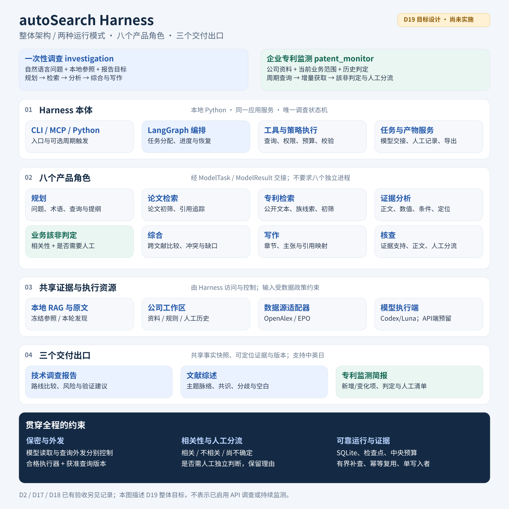
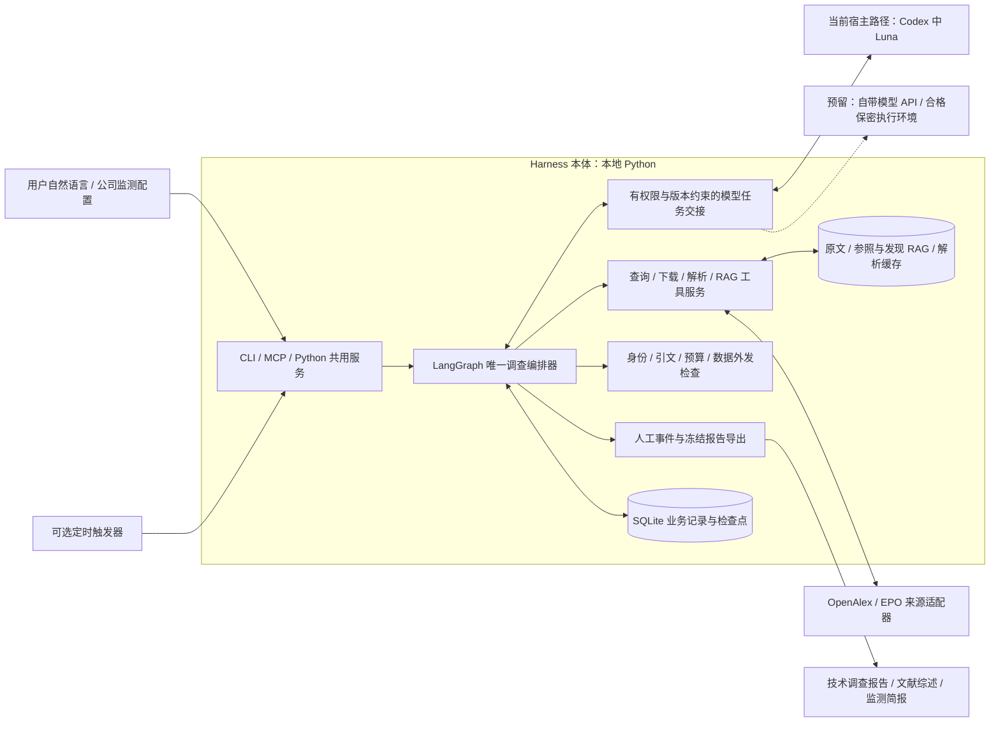
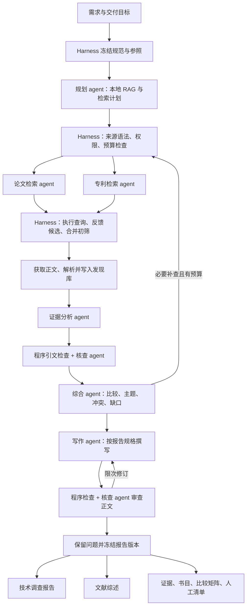
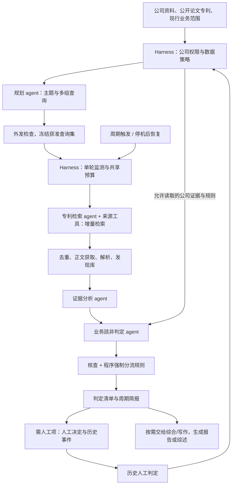
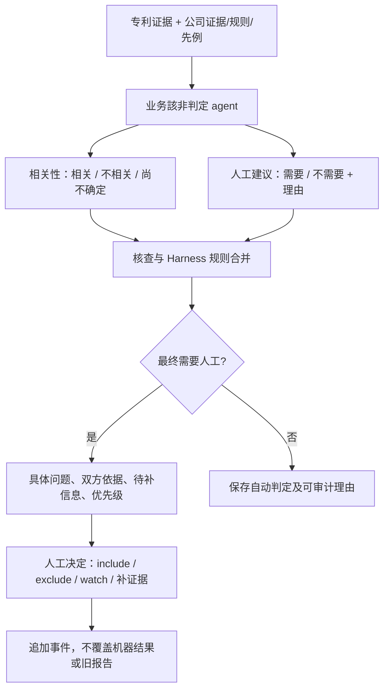

> 当前执行入口：[INTEGRATION_STAGE.md](INTEGRATION_STAGE.md)（2026-10-05，用户批准 S0–S6 实施）。下文历史阶段的“仅设计/不实现 GUI”等表述保留其历史范围，不限制本轮；实际通过状态按本轮固定候选记录。

# autoSearch Harness 整体设计

2026-09-10 · D19 整合设计 v1.0 · 中文权威设计稿

> 2026-09-24 实现状态补充：模型 API 自动执行已接入首批五家协议配置与离线测试；真实厂商在线及完整科学案例尚待验收。以 [D19_MODEL_API_STAGE.md](D19_MODEL_API_STAGE.md) 为准。下文的“预留”表格为原设计时点快照。

本设计整合已确认的本地 RAG、模型宿主、论文/专利调查、双报告出口、企业专利监测及人工分流需求。本文是 D19 当前设计入口，不代表功能已经实现。当前交付仅包含文档和设计图；编码、真实 API 调试、保密资料接入、定时任务启用分别按实施阶段推进。

## 1. 产品目标与范围

Harness 将用户的问题或公司的技术关注范围转成可追溯的检索任务，组织论文和专利证据，完成分析、核查及必要的人工处理，输出可以复核的研究成果。

| 运行模式 | 输入 | 持续行为 | 交付出口 |
|---|---|---|---|
| 一次性调查 investigation | 自然语言需求、本地参照、研究问题、交付目标 | 规划、检索、获取正文、分析、有限补查、写作 | 技术调查报告、文献综述，可选其一或两者 |
| 企业监测 patent_monitor | 公司资料库、业务范围、历史判定、监测查询集 | 周期增量查询、判定新项/变化项、人工分流、断点恢复 | 专利监测简报与累计清单；按需汇总成报告或综述 |

中英日共用事实、证据身份和人工决定；企业保密内容遵守独立的数据处理政策。首版保留 CLI/MCP 和 Python 应用服务，不增加 GUI 或 HTTP 服务。系统综述/元分析、法律有效性及侵权判断、全面 OCR/化学结构识别不属于当前交付范围。

### 1.1 已有能力与目标能力

| 状态 | 能力 | 依据 |
|---|---|---|
| 已有且有独立记录 | D2 离线框架、结构化服务、冻结报告与人工历史 | [框架验收](FRAMEWORK_ACCEPTANCE.md) |
| 已有局部真实验证 | D17 开放论文搜索与下载；23篇全文采集 | [采集记录](OA_COLLECTION.md)；匿名成功不代表账号认证验证 |
| 已有且有独立记录 | D18 本地全文 RAG、Codex/Luna MCP 路径 | [RAG验收](RAG_ACCEPTANCE.md) |
| 本设计待实现/集成 | 真实调查编排、八角色任务交接、双报告写作、企业监测与人工分流 | 本文及[实验方案](INVESTIGATION_EXPERIMENT_PLAN.md) |
| 预留、不得宣称已可用 | 通用生成模型 API 执行器、严格保密本地推理执行器 | 实际实现和运行环境需另有验证 |

已有 providers.py 包含来源适配草稿，不代表 EPO 真实闭环已验收。现有23篇 RAG 继续复用；不因新增流程重新全量下载、解析或嵌入。

## 2. 系统总图

[PNG版本](diagrams/harness-overview.png)便于直接查看和分享。图中层级为职责划分；两个模式复用同一套组件，八个角色按任务调用，不要求八个独立进程。

实线表示目标主路径，虚线表示执行器预留边界，均不能替代实现状态表。模型只获得经政策允许的输入和工具能力；模型返回先检查，再由服务执行。定时器只唤起任务，不增加第二套调查状态机。原文和大文本留在业务存储，通过稳定引用传给节点，不无限累计在模型消息中。

### 2.1 模型身份与数据身份

- 用户订阅路径：在 Codex 内由 Luna 承担模型任务，Harness 本体不读取或转用订阅凭据。
- 用户自带模型 API：沿用 ModelTask/ModelResult 契约；具体模型必须由已实现适配器且满足任务能力要求，不能承诺任意模型无需适配即可运行。
- 数据源 API：OpenAlex/EPO 的凭据独立配置，只引用环境变量名，日志不输出密钥。
- 保密执行路径：按公司政策选执行环境；不合格时等待，不静默改走普通外部模型。当前未实现的执行器明确显示 unsupported/awaiting_eligible_executor。

## 3. 产品内八个 agent 角色

| 角色 | 负责的动作 | 交付给 Harness 的结果 |
|---|---|---|
| 规划 | 理解需求和交付目标；从允许读取的 RAG 归纳主题、术语、检索策略与章节 | ResearchSpec 草案、SearchPlan、提纲和缺口 |
| 论文检索 | 判断候选相关性、研究类型、可核实的引用线索；建议查询修订和全文获取 | 筛选理由、论文候选及有界补查建议 |
| 专利检索 | 判断技术线索、公开文本和族关系；建议来源查询与正文获取 | 专利候选、关联依据、查询/获取建议 |
| 证据分析 | 阅读正文及表格上下文；提取材料、方法、数值、单位、条件和定位 | observations、逐项 Finding、双方证据引用 |
| 业务該非判定 | 将专利与公司范围/先例对应；判断相关性及是否需要人工 | relevance、human_review_required、理由、具体人工问题 |
| 综合 | 跨文献比较、组织主题和机制、呈现一致/冲突证据、识别缺口 | 比较矩阵、综合主张、GapRequest |
| 写作 | 按目标读者、报告类型和语言形成章节 | 正文、原子主张与证据映射 |
| 核查 | 检查引用支持关系、条件遗漏、过度概括和漏转人工 | supported/contradicted/insufficient、修订或转人工要求 |

角色是受约束的逻辑任务；首版宿主可按任务顺序承担多个角色。来源网络 I/O 可以并行，模型工作者并行能力需单独实测。核查任务与写作/判定任务分开输入和结果，同模型多次判断不称为独立科学真值。

Harness 本体承担：阶段调度、查询与结果验证、HTTP 请求、下载/解析/嵌入、数据策略、预算、并发、重试、恢复、引用编号、导出和事件记录。上述确定性步骤不再包装成额外 agent。开发者 Terra/Luna 与本表产品角色是不同层次。

## 4. 一次性调查与双报告工作流

来源结果可在规定轮数内交给检索角色修订；所有补查共用预算。正文发现科学缺口时提交 GapRequest，经综合/规划评估后走同一补查管线；写作角色不能自行添加无来源事实。预算不足时保留问题并降级结论，仍可生成明确标识范围的部分报告。

| 技术调查报告 | 文献综述 |
|---|---|
| 回答有哪些路线、差异是什么、下一步验证什么 | 回答领域如何发展、共识与争议是什么、研究空白在哪里 |
| 摘要、范围与方法、技术路线、条件明确的比较、相关专利、风险及验证建议 | 检索范围与方法、主题框架、机制/方法脉络、跨文献综合、分歧与空白、结论展望 |
| 专利宣称、实施例与论文实验分开呈现 | 论文为主体，必要时设专利与技术转化部分；不能逐篇摘要拼接 |

两者共享事实快照、证据身份和书目；输出 Markdown/HTML、规范化 JSON、CSV 附件及基于真实元数据的 BibTeX。默认文献综述为主题综述。原文引用与译文区分，未知字段保留未知；不把综述和它引用的同一实验双计为独立支持。DOCX/PDF 排版后续接入。

## 5. 企业专利持续监测工作流

“实时”落实为有界周期轮询及延迟收录回看，周期、地区、初始回查范围在配置阶段指定。公开时间、来源更新时间（若提供）、首次发现时间、最近检查时间、判定时间分别记录；不承诺来源尚未收录的信息能立即发现。

1. 查询集按公司主题组织，覆盖核心技术、同义词/分类、相邻替代路线和可核实引用线索。搜索其他申请人的相关技术，不能只搜本公司名称。
2. 首次初始化与后续新项分开；每个公司/来源/查询版本独立保存分页、回看窗口和完整检查点。
3. 候选持久化且查询窗口完整后才推进检索位置；失败或截断不推进。已采集与已判定是两个进度，宿主断开时显示积压而不是完成。
4. 公开号+地区+kind 标识公开文本，同族聚合展示不抹掉文本差异；新正文/新公开文本/规则变化触发适用范围内重判。
5. 同一监测任务只允许一个活动 run；重叠触发合并或跳过，停机后补查。每轮预算和跨轮累计预算同时约束。
6. 已冻结查询无需每周期重写，既有原文/解析/向量按内容复用。监测发现默认 discovery，不自动成为公司业务或技术能力的参照依据。
7. 默认产物落本地。通知渠道及内容另配置；实质新增、变化或故障才产生通知事件，相同问题不重复提醒。

## 6. 相关性与人工判定：两个独立结果

相关性字段为 relevant / irrelevant / uncertain；人工分流为 human_review_required。每条已完成模型判定的项目必须明确两者。尚未判定的项目是 awaiting_model，不能用 false 假装无需人工。

| 情况 | 相关性 | 人工处理 |
|---|---|---|
| 双方证据充分、范围明确、无冲突或强制复核规则 | 相关或不相关 | 不需要，保留理由 |
| 明确相关且命中公司强制复核主题 | 相关 | 需要 |
| 暂定不相关，但与适用先例冲突或需要业务负责人界定 | 有据的暂定结论或尚不确定 | 需要 |
| 关键证据缺失、引用无效、规则冲突或需修改公司规则 | 无足够依据则尚不确定 | 需要 |

最终转人工取模型建议、核查升级和强制规则的并集；模型置信度不能撤销强制条件。可自动补证据的缺口先做有限补查，结束仍不确定的项目必须转人工。记录 review_reason_codes、具体问题、支持/反对证据、缺失信息和优先级依据，不用一个百分数替代理由。

人工队列与相关性正交，因此相关或不相关的项目均可能在队列中。历史决定仅在对应公司、规则与证据范围内生效；新实质证据可 reopen，重复相同问题复用 issue ID。人工 watch 是已解决的“继续观察”决定；模型提出的待人工问题仍为 open。下一轮模型改为无需人工不能静默关闭已有 open 项。单项人工决定不能隐式修改公司全局规则。

## 7. 保密数据与权限

每家公司使用独立工作区并绑定 company_id；在检索、任务领取和证据读取前检查权限。文件/证据至少区分 public 与 confidential。业务关联、派生主题、内部判断、模型输入输出、日志和报告继承来源中更严格的限制。

| 边界 | 必须执行的控制 |
|---|---|
| 资料进入模型 | 按公司政策选择允许的证据及执行器；本地 RAG 不等于推理留在本地 |
| 查询发给专利数据库 | 内部意图与外发查询分别保存；术语组合也检查；敏感派生查询按政策批准后冻结版本和目标来源 |
| 发现库与基准库 | 本轮基准冻结；新资料默认发现；不同公司的检索、缓存和证据访问不能串库 |
| 简报与对外报告 | 内部版本可含获准的保密引用；可分享版本按策略生成，没有脱密依据则不生成 |
| 日志与调试 | 不记录密钥或不允许外发的内容；原文、运行库、公司资料、会话留在 Git 忽略区 |

去掉公司名不等于脱密；公开术语的组合也可能暴露研发方向。获准查询可反复执行，实质修改才重新按政策处理。严格保密路径没有合格执行器时，任务等待；公开采集可以独立继续。公司未提供资料与政策前，先用合成保密标记测试流程，不访问真实秘密。

## 8. 数据契约与证据链

所有持久化对象采用普通 JSON/domain 字段，SDK/LangGraph 对象不成为公共契约。沿用现有身份、业务存储与 ReportData，不建设平行数据库。

| 对象 | 最小职责与绑定关系 |
|---|---|
| ResearchSpec + report_spec | 原始需求、范围/条件、来源、预算、报告类型/读者/语言、研究问题与提纲 |
| CompanyProfile | 公司范围、规则、历史依据、证据与数据策略版本 |
| MonitorSpec | 来源、查询集版本、地区、频率、初始化与回看窗口、跨轮预算和产物 |
| BaselineSnapshot | 选定 document/version/evidence 与指纹，本轮不可变 |
| SearchPlan / Query | 原始意图、来源表达式、目的、出处、父查询、验证和外发状态 |
| SourceAttempt / Candidate | 页游标、完整性、来源错误、查询命中、筛选理由、稳定公开身份 |
| Acquisition / Evidence | 原始字节、内容指纹、覆盖、文档版本、章节角色、原文和 locator |
| ModelTask / ModelResult | task_id、角色/类型、输入版本引用、允许操作、schema、预算归属、结果 |
| Finding | 原值/单位/条件、双方证据、反证、可比较性、相关性、人工建议与最终核查结果 |
| GapRequest / ReviewIssue | 缺失问题、影响主张、补查需求；稳定 issue 与 open/resolved/reopened 事件 |
| ReportData / Artifact | 事实快照、章节/主张、证据映射、书目、覆盖、人工快照、类型/版本/语言/格式/路径 |

证据链为：查询 → 候选 → 公开文本与原文版本 → 证据/上下文 → Finding → 报告主张 → 正文。公司侧引用另连 CompanyProfile 与冻结基准。DOI 规范化；专利申请号、公开号、kind 不混用。PDF 保存物理页/位置，XML 保存 claim/paragraph/XPath；不编造页码。

D19 引句需逐字匹配原证据的连续子串，检查所属文档、版本和基准范围。D2 旧 fixture 的整段相等规则保持兼容。数值、单位、表头、条件与脚注一起解释；未报告不等于0，不同条件不直接排名。原始模型结果与检查后的有效结论分别保存。

## 9. 服务、任务恢复与预算

拟复用/扩展应用服务如下；这些新增名称是设计接口，不是当前可执行命令保证。

| 服务职责 | 拟操作 |
|---|---|
| 需求/配置 | 验证与保存 spec/profile/monitor/query revision，draft 不启动 |
| 调查执行 | create_investigation、advance_investigation、resume_investigation |
| 模型交接 | get_pending_tasks、submit_model_result；同结果重交幂等，不同或过期结果拒绝 |
| 监测控制 | validate、run-once、status、pause、resume；定时宿主调用同一 run-once |
| 状态/产物 | status、get_result、get_artifacts；禁止调用方直接读内部数据库对象 |
| 人工与导出 | review_list、review_decide、report；变更追加版本，导出失败可独立重试 |

LangGraph 保存阶段进度，SQLite 保存业务事实与账本。等待原因（awaiting_model、awaiting_eligible_executor、awaiting_evidence）、run outcome（completed/partial/failed/cancelled）、source 状态、人工 issue 状态分别表达；完整执行但有人工作业未处理不必伪装为运行失败。长期监测本身有启用/暂停状态，每一轮有独立 outcome。

长下载与解析由可恢复 worker 执行；MCP 领取任务和读取状态，不阻塞整批全文。Qdrant embedded 每路径只有一个所有者，按阶段释放再读写；HTTP 可并行。外部请求响应未保存的崩溃窗口标 uncertain 并计入预算，不承诺外部调用 exactly-once。

保留实验方案的中央预留/结算及上限：单次候选50、正文10、I/O并发3、每文件30 MiB、每轮300 MiB、模型任务120；补查最多2轮，正文每交付物修订最多2轮。所有角色共用配额；监测另设跨轮总预算，配置未完整时不启用周期执行。这些是待校准工程默认值，不是公司判定阈值或服务商限额。正式评价前统一校准活动时间预算并冻结。

只改语言/正文或导出格式不重新下载/嵌入。更换规则、基准或原文版本按依赖关系重新判断，保留旧证据、旧报告和人工历史。记录规划、查询、下载、解析、嵌入、分析、综合、写作、核查、渲染各段耗时。宿主内部 token/订阅账单不可见时为 null，不以任务数冒充精确计费。

## 10. 实施分工与验收路线

| 阶段 | 必须交付与验收 |
|---|---|
| P0 设计整合 | 本文、设计图、公共契约方向、实验方案及决策记录；当前交付 |
| P1 离线框架 | 两模式的任务/状态、角色输入输出、双报告正文、监测多周期回放、脚本/包/三语指南；F01–F12及相关O/M合成检查 |
| P2 单源 API | OpenAlex/EPO 小流量认证、查询、分页、正文、日期和延迟可观测性；A01–A06 |
| P3 论文闭环 | 真实宿主从需求到库外论文、发现库及两种正文小样；专利覆盖如实标待接入 |
| P4 联合调查 | 专利公开文本/族与正文、三语独立检索集和双出口；E01–E07、O01–O04 |
| P5 企业监测 | 连续周期、变化/回看、宿主积压补判、人工分流及合格保密路径；M01–M08 |

具体场景、分母、预算校准和拟冻结阈值以[实验方案](INVESTIGATION_EXPERIMENT_PLAN.md)为准。P1 不调用真实数据源；P2 两来源可独立推进。模拟、组件、真实 API、宿主、科学效果、保密环境及无人值守分别给出证据，不能互相替代。

人工分流独立评价“应转人工却漏转”和“不必要转人工”，相关性评价同时报告错误排除与检索漏检；不能全部转人工以规避判定质量。公司业务样本和阈值由公司范围、漏检代价与冻结样本确定，不套用通用材料阈值。

| 开发责任 | 归属 |
|---|---|
| 设计者 | 需求/架构/契约、根因诊断、独立样本与验收；不写产品实现 |
| Terra | 编排、来源、RAG接线、存储、预算/数据策略、判定与报告结构、导出、最终集成及自测 |
| Luna | MCP/宿主任务交接、八角色任务说明、用户指南与协议自测；公共文件由Terra统一集成 |

后续授权实施时按不可变检查点自测→独立验收→直接修正。现阶段不派发实现、不创建定时任务、不上传公司资料，也不再次同步 GitHub。

## 11. 文档关系与下一阶段输入

本文是当前整合设计入口，优先解释旧 D1/D2 文档中的阶段描述。[ARCHITECTURE](ARCHITECTURE.md)、[PRD](PRD.md)、[CONTRACTS](CONTRACTS.md)保留历史要求及兼容契约；[实验方案](INVESTIGATION_EXPERIMENT_PLAN.md)负责详细步骤与验收矩阵；[DECISIONS](DECISIONS.md)保留变更原因。图示与正文共同描述目标结构，已实现能力仅以各阶段验收记录为据。

进入真实企业监测前需要：公司现行业务范围、资料分级与允许的执行环境、专利地区/年代、监测频率与发现延迟目标、来源凭据、跨周期预算，以及用于独立相关性/人工分流评价的样本。缺这些信息不妨碍先搭离线框架，涉及对应真实行为时再完成配置。

### 统一上下文管理设计增补（2026-09-25）

调查任务、RAG、GUI 会话和模型适配器之间的上下文读取与审计，按 [C0–C4 落地方案](CONTEXT_MANAGEMENT_IMPLEMENTATION_PLAN_20260925.md) 分阶段设计。运行输入、历史对象版本、检索选择、单次模型输入及其收据各有独立身份；旧输入重放不隐式重新检索，派生产物继承来源限制，定位/引句与主张支持分别核查。方案为设计契约，未改变本文已实现能力表；各阶段的代码、真实宿主及科学效果须分别验收。
